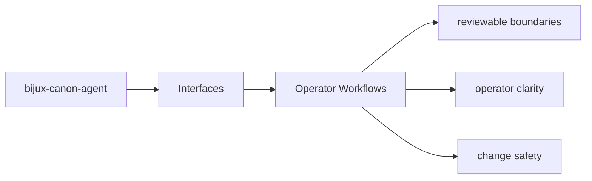

# Operator Workflows

Operator workflows should start from documented package entrypoints and end in reviewable outputs.

## Page Maps

## Workflow Anchors

- entry surfaces: CLI entrypoint in src/bijux_canon_agent/interfaces/cli/entrypoint.py, operator configuration under src/bijux_canon_agent/config, HTTP-adjacent modules under src/bijux_canon_agent/api
- durable outputs: trace-backed final outputs, workflow graph execution records, operator-visible result artifacts
- validation backstops: tests/unit for local behavior and utility coverage, tests/integration and tests/e2e for end-to-end workflow behavior

## Purpose

This page connects package interfaces to the workflows an operator actually performs.

## Stability

Keep it aligned with the existing commands, endpoints, and outputs.
