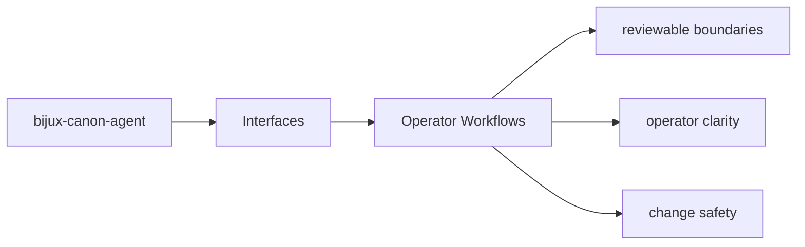
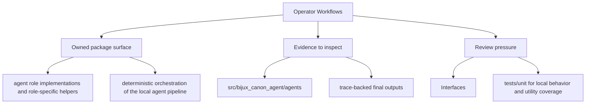

# Operator Workflows

Operator workflows should start from documented package entrypoints and end in reviewable outputs.

## Page Maps

## Workflow Anchors

- entry surfaces: CLI entrypoint in src/bijux_canon_agent/interfaces/cli/entrypoint.py, operator configuration under src/bijux_canon_agent/config, HTTP-adjacent modules under src/bijux_canon_agent/api
- durable outputs: trace-backed final outputs, workflow graph execution records, operator-visible result artifacts
- validation backstops: tests/unit for local behavior and utility coverage, tests/integration and tests/e2e for end-to-end workflow behavior

## Concrete Anchors

- CLI entrypoint in src/bijux_canon_agent/interfaces/cli/entrypoint.py
- operator configuration under src/bijux_canon_agent/config
- HTTP-adjacent modules under src/bijux_canon_agent/api
- apis/bijux-canon-agent/v1/schema.yaml

## Use This Page When

- you need the public command, API, import, or artifact surface
- you are checking whether a caller can rely on a given shape or entrypoint
- you need the contract-facing side of the package before using it

## What This Page Answers

- which public or operator-facing surfaces bijux-canon-agent exposes
- which artifacts and schemas act like contracts
- what compatibility pressure this surface creates

## Reviewer Lens

- compare commands, API files, imports, and artifacts against the documented surface
- check whether schema or artifact changes need compatibility review
- confirm that operator-facing examples still point at real entrypoints

## Honesty Boundary

This page can identify the intended public surfaces of bijux-canon-agent, but real compatibility still depends on code, schemas, artifacts, and tests staying aligned.

## Purpose

This page connects package interfaces to the workflows an operator actually performs.

## Stability

Keep it aligned with the existing commands, endpoints, and outputs.

## Core Claim

The interface claim of `bijux-canon-agent` is that commands, APIs, imports, schemas, and artifacts form a reviewable contract rather than an implied one.

## Why It Matters

If the interface pages for `bijux-canon-agent` are weak, callers cannot tell which commands, schemas, or artifacts are stable enough to depend on, and compatibility review arrives too late.

## If It Drifts

- callers depend on surfaces that are less stable than the docs imply
- schema and artifact changes stop receiving the compatibility review they need
- operator examples begin pointing at stale or misleading entrypaths

## Representative Scenario

An operator or downstream caller wants to depend on a `bijux-canon-agent` surface and needs to know which command, API, schema, import, or artifact is stable enough to treat as a contract.

## Source Of Truth Order

- `packages/bijux-canon-agent/src/bijux_canon_agent` for the implemented boundary
- `apis/bijux-canon-agent/v1/schema.yaml` as tracked contract evidence
- `packages/bijux-canon-agent/tests` for compatibility and behavior proof

## Common Misreadings

- that every visible package surface is equally stable
- that one schema or example is the whole compatibility story
- that interface docs override package code, artifacts, or tests when they disagree
