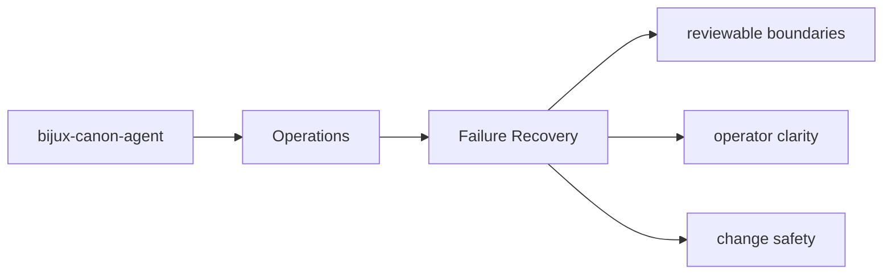
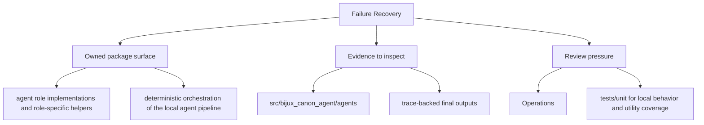

# Failure Recovery

Failure recovery starts with knowing which artifacts, interfaces, and tests expose the problem.

## Page Maps

## Recovery Anchors

- interface surfaces: CLI entrypoint in src/bijux_canon_agent/interfaces/cli/entrypoint.py, operator configuration under src/bijux_canon_agent/config, HTTP-adjacent modules under src/bijux_canon_agent/api
- artifacts to inspect: trace-backed final outputs, workflow graph execution records, operator-visible result artifacts
- tests to run: tests/unit for local behavior and utility coverage, tests/integration and tests/e2e for end-to-end workflow behavior

## Purpose

This page gives maintainers a durable frame for triaging package failures.

## Stability

Keep it aligned with the package entrypoints and diagnostic outputs.
