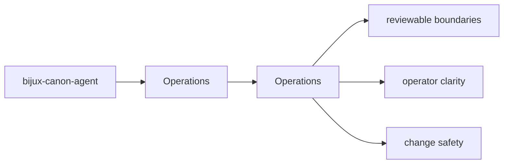
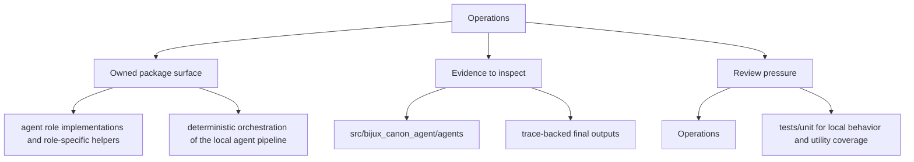

# Operations

bijux-canon-agent operations pages describe how to install, run, observe, release, and safely operate the package.

## Page Maps

## Pages in This Section

- [Installation and Setup](installation-and-setup.md)
- [Local Development](local-development.md)
- [Common Workflows](common-workflows.md)
- [Observability and Diagnostics](observability-and-diagnostics.md)
- [Performance and Scaling](performance-and-scaling.md)
- [Failure Recovery](failure-recovery.md)
- [Release and Versioning](release-and-versioning.md)
- [Security and Safety](security-and-safety.md)
- [Deployment Boundaries](deployment-boundaries.md)

## Read Across the Package

- [Foundation](../foundation/index.md)
- [Architecture](../architecture/index.md)
- [Interfaces](../interfaces/index.md)
- [Quality](../quality/index.md)

## Concrete Anchors

- `packages/bijux-canon-agent/pyproject.toml` for package metadata
- `packages/bijux-canon-agent/README.md` for local package framing
- `packages/bijux-canon-agent/tests` for executable operational backstops

## Use This Page When

- you are installing, running, diagnosing, or releasing the package
- you need operational anchors rather than conceptual framing
- you are responding to package behavior in a local or CI environment

## What This Page Answers

- how bijux-canon-agent is installed, run, diagnosed, and released
- which files or tests matter during package operation
- where an operator should look when behavior changes

## Reviewer Lens

- verify that setup, workflow, and release references still match package metadata
- check that operational docs point at current diagnostics and validation paths
- confirm that release-facing claims match the package's actual versioning files

## Honesty Boundary

This page explains how bijux-canon-agent is expected to be operated, but it does not replace package metadata, runtime behavior, or validation runs in a real environment.

## Section Contract

- define what the operations section covers for bijux-canon-agent
- point readers to the topic pages that hold the detailed explanations
- keep the section boundary reviewable as the package evolves

## Reading Advice

- start here when you know the package but not yet the right page inside the section
- use the page list to choose the narrowest topic that matches the current question
- move across sections only after this section stops being the right lens

## Purpose

This page explains how to use the operations section for `bijux-canon-agent` without repeating the detail that belongs on the topic pages beneath it.

## Stability

This page is part of the canonical package docs spine. Keep it aligned with the current package boundary and the topic pages in this section.

## Core Claim

The operational claim of `bijux-canon-agent` is that install, run, diagnose, and release paths can be repeated from explicit package assets instead of oral history.

## Why It Matters

If the operations pages for `bijux-canon-agent` are weak, maintainers end up relearning install, diagnose, and release behavior from trial and error instead of from checked-in package truth.

## If It Drifts

- maintainers relearn package operation by trial and error
- release and setup steps quietly diverge from the checked-in package metadata
- diagnostic workflows become harder to repeat under incident pressure
