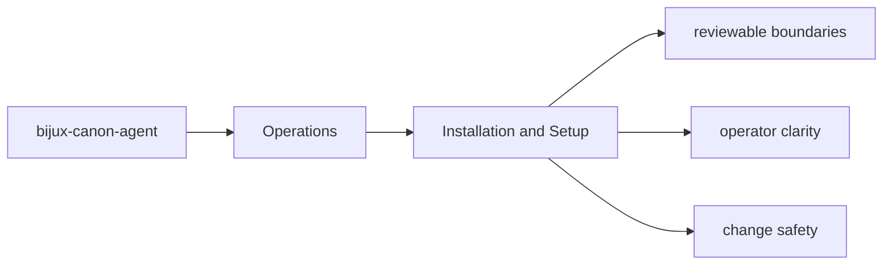
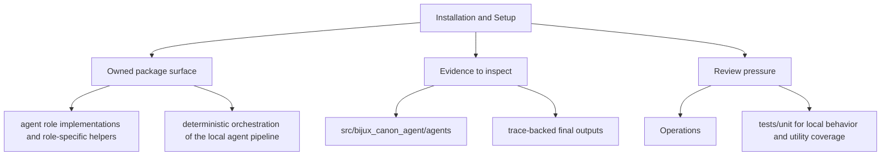

# Installation and Setup

Installation for `bijux-canon-agent` should start from the package metadata and the specific
optional dependencies that matter for the work being done.

## Page Maps

## Package Metadata Anchors

- package root: `packages/bijux-canon-agent`
- metadata file: `packages/bijux-canon-agent/pyproject.toml`
- readme: `packages/bijux-canon-agent/README.md`

## Dependency Themes

- aiohttp
- typer
- click
- pydantic
- fastapi
- openai
- structlog
- pluggy

## Use This Page When

- you are installing, running, diagnosing, or releasing the package
- you need operational anchors rather than conceptual framing
- you are responding to package behavior in a local or CI environment

## What This Page Answers

- how bijux-canon-agent is installed, run, diagnosed, and released
- which files or tests matter during package operation
- where an operator should look when behavior changes

## Reviewer Lens

- verify that setup, workflow, and release references still match package metadata
- check that operational docs point at current diagnostics and validation paths
- confirm that release-facing claims match the package's actual versioning files

## Purpose

This page tells maintainers where setup truth actually lives for the package.

## Stability

Keep it aligned with `pyproject.toml` and the checked-in package metadata.
