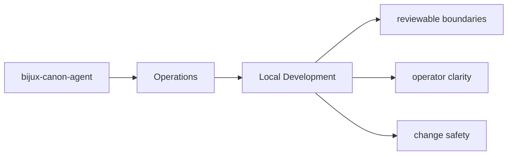

# Local Development

Local development should happen inside `packages/bijux-canon-agent` with tests and docs updated
in the same change series as the code.

## Page Maps

## Development Anchors

- tests/unit for local behavior and utility coverage
- tests/integration and tests/e2e for end-to-end workflow behavior
- tests/invariants for package promises that should not drift
- tests/api for HTTP-facing validation

## Purpose

This page records the package-local development posture.

## Stability

Keep it aligned with the actual test layout and maintenance workflow.
