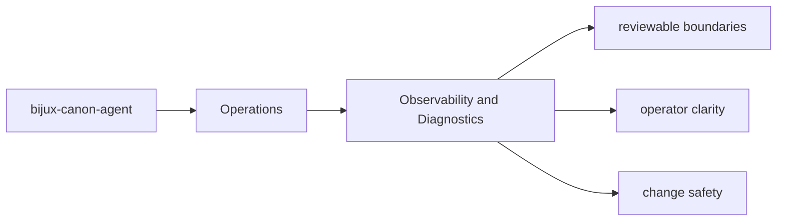
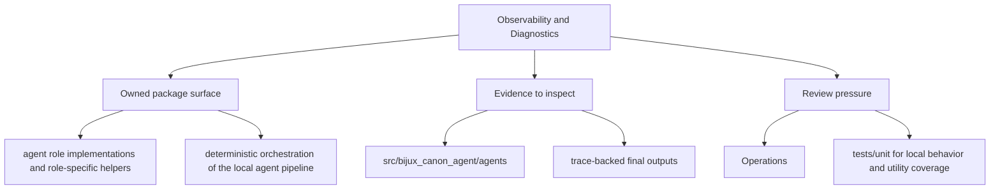

# Observability and Diagnostics

Diagnostics should make it easier to explain what `bijux-canon-agent` did, not merely that it ran.

## Page Maps

## Diagnostic Anchors

- trace-backed final outputs
- workflow graph execution records
- operator-visible result artifacts

## Supporting Modules

- `src/bijux_canon_agent/traces` for trace-facing models and persistence helpers

## Use This Page When

- you are installing, running, diagnosing, or releasing the package
- you need operational anchors rather than conceptual framing
- you are responding to package behavior in a local or CI environment

## What This Page Answers

- how bijux-canon-agent is installed, run, diagnosed, and released
- which files or tests matter during package operation
- where an operator should look when behavior changes

## Purpose

This page points readers toward the package's observable output and diagnostic support.

## Stability

Keep it aligned with the package modules and artifacts that currently support diagnosis.
