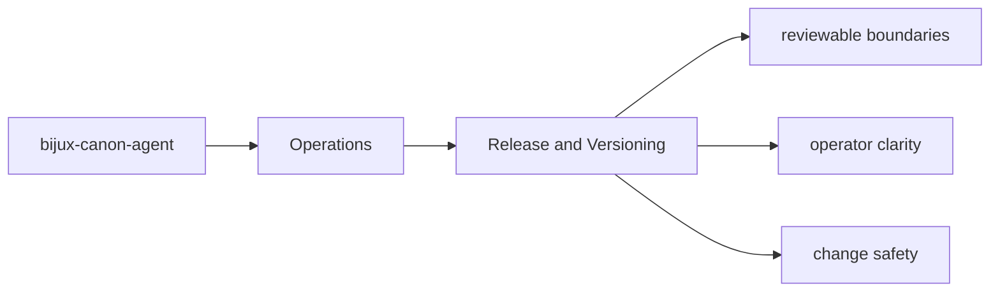
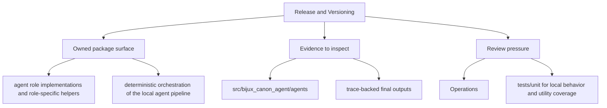

# Release and Versioning

Release work for `bijux-canon-agent` depends on package metadata, tracked release notes, and
the repository's commit conventions.

## Page Maps

## Release Anchors

- README.md
- CHANGELOG.md
- pyproject.toml

## Versioning Anchors

- version file: `packages/bijux-canon-agent/src/bijux_canon_agent/_version.py`
- tag pattern is configured in `packages/bijux-canon-agent/pyproject.toml`

## Use This Page When

- you are installing, running, diagnosing, or releasing the package
- you need operational anchors rather than conceptual framing
- you are responding to package behavior in a local or CI environment

## What This Page Answers

- how bijux-canon-agent is installed, run, diagnosed, and released
- which files or tests matter during package operation
- where an operator should look when behavior changes

## Purpose

This page ties package-local release mechanics to the wider repository release model.

## Stability

Keep it aligned with the package metadata and current versioning configuration.
