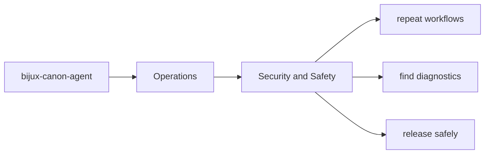
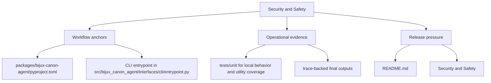

# Security and Safety

Security review in `bijux-canon-agent` should focus on the package's real boundary surfaces and outputs.

This page keeps safety work concrete. A useful security discussion starts from
the actual interfaces, artifacts, and authority the package holds, not from
generic caution language detached from the codebase.

Read the operations pages for `bijux-canon-agent` as the package's explicit operating memory. They should make common tasks repeatable without forcing maintainers to relearn the workflow from code, CI logs, or oral history.

## Page Maps

## Review Anchors

- CLI entrypoint in src/bijux_canon_agent/interfaces/cli/entrypoint.py
- operator configuration under src/bijux_canon_agent/config
- HTTP-adjacent modules under src/bijux_canon_agent/api

## Safety Rule

Any change that broadens package authority should update docs, tests, and release notes together.

## Concrete Anchors

- `packages/bijux-canon-agent/pyproject.toml` for package metadata
- `packages/bijux-canon-agent/README.md` for local package framing
- `packages/bijux-canon-agent/tests` for executable operational backstops

## Use This Page When

- you are installing, running, diagnosing, or releasing the package
- you need repeatable operational anchors rather than architectural framing
- you are responding to package behavior in local work, CI, or incident pressure

## Decision Rule

Use `Security and Safety` to decide whether a maintainer can repeat the package workflow from checked-in assets instead of memory. If a step works only because someone already knows the trick, the workflow is not documented clearly enough yet.

## What This Page Answers

- how `bijux-canon-agent` is installed, run, diagnosed, and released in practice
- which checked-in files and tests anchor the operational story
- where a maintainer should look first when the package behaves differently

## Reviewer Lens

- verify that setup, workflow, and release statements still match package metadata and current commands
- check that operational guidance still points at real diagnostics and validation paths
- confirm that maintainer advice still works under current local and CI expectations

## Honesty Boundary

This page explains how `bijux-canon-agent` is expected to be operated, but it does not replace package metadata, actual runtime behavior, or validation in a real environment. A workflow is only trustworthy if a maintainer can still repeat it from the checked-in assets named here.

## Next Checks

- move to interfaces when the operational path depends on a specific surface contract
- move to quality when the question becomes whether the workflow is sufficiently proven
- move back to architecture when operational complexity suggests a structural problem

## Purpose

This page keeps security review grounded in concrete package seams.

## Stability

Keep it aligned with the package interfaces and operational risk profile.
