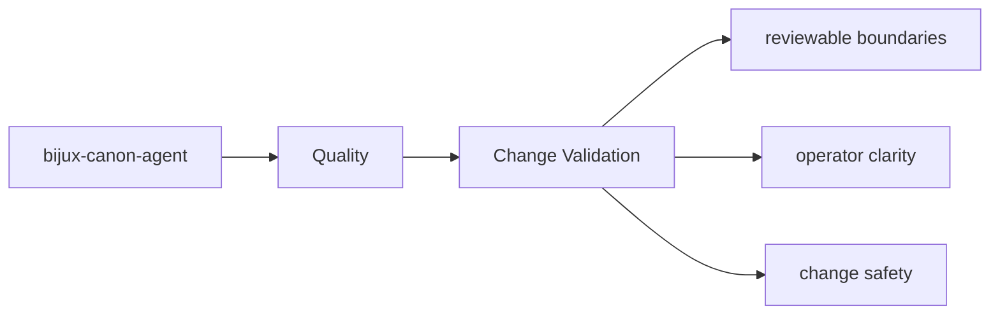

# Change Validation

Validation after a change should target the package surfaces that were actually touched.

## Page Maps

## Validation Targets

- interface changes should update interface docs and owning tests
- artifact changes should update artifact docs and consuming tests
- architectural changes should update section pages that explain the package seam

## Test Anchors

- tests/unit for local behavior and utility coverage
- tests/integration and tests/e2e for end-to-end workflow behavior
- tests/invariants for package promises that should not drift
- tests/api for HTTP-facing validation

## Purpose

This page records how to choose meaningful validation for package work.

## Stability

Keep it aligned with the package's current test layout and docs structure.
