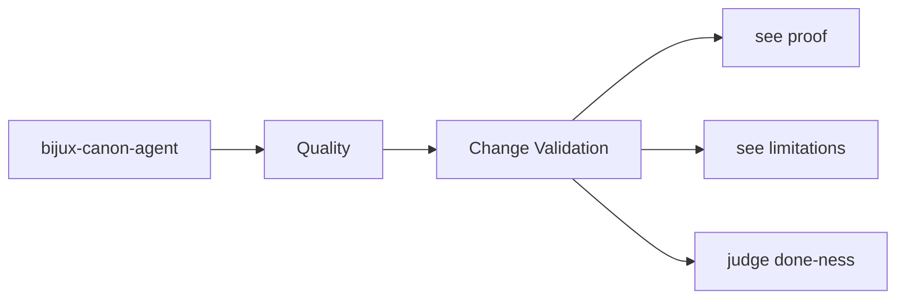
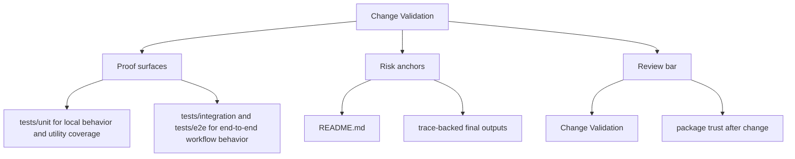

# Change Validation

Validation after a change should target the package surfaces that were actually touched.

This page is about choosing proof that matches the real risk. Strong validation
is not just more testing; it is testing and review aimed at the seam that moved.

Treat the quality pages for `bijux-canon-agent` as the proof frame around the package. They should show how trust is earned and where skepticism still belongs.

## Page Maps

## Validation Targets

- interface changes should update interface docs and owning tests
- artifact changes should update artifact docs and consuming tests
- architectural changes should update section pages that explain the package seam

## Test Anchors

- tests/unit for local behavior and utility coverage
- tests/integration and tests/e2e for end-to-end workflow behavior
- tests/invariants for package promises that should not drift
- tests/api for HTTP-facing validation

## Concrete Anchors

- tests/unit for local behavior and utility coverage
- tests/integration and tests/e2e for end-to-end workflow behavior
- README.md

## Use This Page When

- you are reviewing tests, invariants, limitations, or ongoing risks
- you need evidence that the documented contract is actually defended
- you are deciding whether a change is truly done rather than merely implemented

## Decision Rule

Use `Change Validation` to decide whether `bijux-canon-agent` has actually earned trust after a change. If one narrow green check hides a wider contract, risk, or validation gap, the work is not done yet.

## What This Page Answers

- what currently proves the `bijux-canon-agent` contract instead of merely describing it
- which risks, limits, and assumptions still need explicit skepticism
- what a reviewer should be able to say before accepting a change as done

## Reviewer Lens

- compare the documented proof story with the actual test layout and release posture
- look for limitations or risks that should have moved with recent behavior changes
- verify that the claimed done-ness standard still reflects real validation practice

## Honesty Boundary

This page explains how `bijux-canon-agent` is supposed to earn trust, but it does not claim that prose alone is enough. If the listed tests, checks, and review practice stop backing the story, the story has to change.

## Next Checks

- move to foundation when the risk appears to be boundary confusion rather than missing tests
- move to architecture when the proof gap points to structural drift
- move to interfaces or operations when the proof question is really about a contract or workflow

## Purpose

This page records how to choose meaningful validation for package work.

## Stability

Keep it aligned with the package's current test layout and docs structure.
