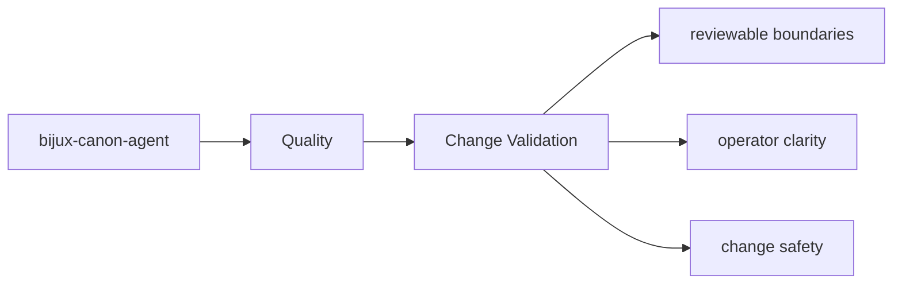
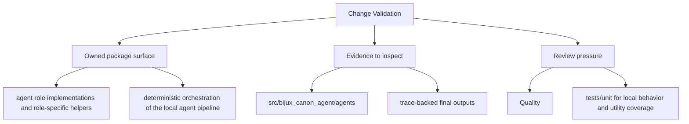

# Change Validation

Validation after a change should target the package surfaces that were actually touched.

This page is about choosing proof that matches the real risk. Strong validation
is not just more testing; it is testing and review aimed at the seam that moved.

Read the quality pages for `bijux-canon-agent` as the proof frame around the package. They should explain how trust is earned, how risk stays visible, and why a passing local check is not always enough.

## Page Maps

## Validation Targets

- interface changes should update interface docs and owning tests
- artifact changes should update artifact docs and consuming tests
- architectural changes should update section pages that explain the package seam

## Test Anchors

- tests/unit for local behavior and utility coverage
- tests/integration and tests/e2e for end-to-end workflow behavior
- tests/invariants for package promises that should not drift
- tests/api for HTTP-facing validation

## Concrete Anchors

- tests/unit for local behavior and utility coverage
- tests/integration and tests/e2e for end-to-end workflow behavior
- README.md

## Use This Page When

- you are reviewing tests, invariants, limitations, or ongoing risks
- you need evidence that the documented contract is actually defended
- you are deciding whether a change is truly done rather than merely implemented

## Decision Rule

Use `Change Validation` to decide whether `bijux-canon-agent` has actually earned trust after a change. If one narrow green check hides a wider contract, risk, or validation gap, the work is not done yet.

## Next Checks

- move to foundation when the risk appears to be boundary confusion rather than missing tests
- move to architecture when the proof gap points to structural drift
- move to interfaces or operations when the proof question is really about a contract or workflow

## Update This Page When

- test layout, invariant protection, or risk posture changes materially
- definition-of-done or validation practice changes in a way reviewers must understand
- known limitations or evidence expectations move with the codebase

## What This Page Answers

- what currently proves the `bijux-canon-agent` contract instead of merely describing it
- which risks, limits, and assumptions still need explicit skepticism
- what a reviewer should be able to say before accepting a change as done

## Reviewer Lens

- compare the documented proof story with the actual test layout and release posture
- look for limitations or risks that should have moved with recent behavior changes
- verify that the claimed done-ness standard still reflects real validation practice

## Honesty Boundary

This page explains how `bijux-canon-agent` is supposed to earn trust, but it does not claim that prose alone is enough. If the listed tests, checks, and review practice stop backing the story, the story has to change.

## Purpose

This page records how to choose meaningful validation for package work.

## Stability

Keep it aligned with the package's current test layout and docs structure.

## What Good Looks Like

- `Change Validation` leaves a reviewer able to say why the package should be trusted after a change
- tests, limitations, and risk language reinforce one another instead of competing
- the completion bar is demanding enough to prevent shallow acceptance

## Failure Signals

- `Change Validation` says the package is protected but cannot show which proof closes which risk
- reviewers disagree on whether the work is done because the standard is too implicit
- limitations remain unchanged even when package behavior has obviously shifted

## Tradeoffs To Hold

- prefer broader proof over narrower green checks when the package contract is larger than one code path
- prefer visible limitations over a cleaner story that hides risk
- prefer a slightly slower approval path over granting `bijux-canon-agent` trust without enough evidence

## Cross Implications

- changes here influence how all other `bijux-canon-agent` sections should be trusted after modification
- foundation, architecture, interface, and operations claims all become weaker if proof expectations drift
- review discipline here determines whether neighboring sections remain explanatory or merely aspirational

## Approval Questions

- does `Change Validation` show enough proof to trust `bijux-canon-agent` after change
- have limitations and known risks moved with the code rather than staying stale
- does the acceptance bar protect the package contract rather than only one local behavior

## Evidence Checklist

- read `packages/bijux-canon-agent/tests` with the page's proof claims in hand
- verify package metadata and release notes in `packages/bijux-canon-agent` do not contradict the review standard
- check whether known limitations, risks, and completion language all moved together in the current change

## Anti-Patterns

- equating one local pass with full contract confidence
- keeping old risk prose after the code and tests have materially changed
- treating definition-of-done language as ceremonial rather than operational

## Escalate When

- the proof story can no longer be updated without revisiting adjacent sections
- a local validation gap reveals a larger boundary or architecture issue
- reviewers cannot agree on done-ness because the underlying contract changed

## Core Claim

The core quality claim of `bijux-canon-agent` is that tests, invariants, visible risks, and completion criteria jointly show whether the package is trustworthy after change.

## Why It Matters

If the quality pages for `bijux-canon-agent` are weak, it becomes difficult to tell whether a change is genuinely safe or merely passes a narrow local check.

## If It Drifts

- reviewers cannot tell whether the listed proof still covers the real risk surface
- limitations stop being visible until they show up as rework later
- definition-of-done language drifts away from actual validation practice

## Representative Scenario

A change appears correct locally, but the reviewer still needs to know whether `bijux-canon-agent` has actually satisfied its proof obligations before the work is accepted.

## Source Of Truth Order

- `packages/bijux-canon-agent/tests` for executable proof
- `packages/bijux-canon-agent/pyproject.toml` and release notes for declared constraints and change posture
- this page for the review lens that explains how to interpret that proof honestly

## Common Misreadings

- that a passing local test automatically satisfies the package review standard
- that documented risks stay valid even when the code and interfaces have changed around them
- that done-ness is only about implementation and not about proof, clarity, and release impact
