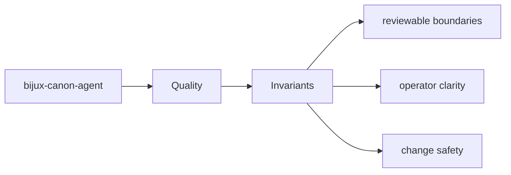
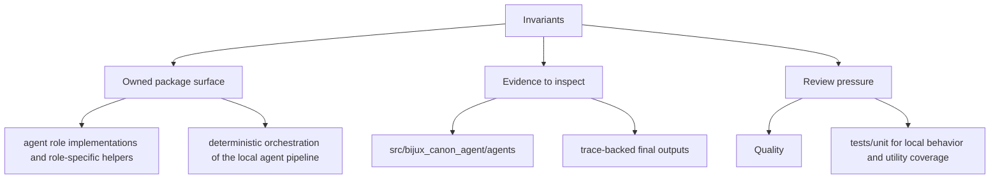

# Invariants

Invariants are the promises that should survive ordinary implementation change.

## Page Maps

## Invariant Anchors

- package boundary stays explicit
- interface and artifact contracts remain reviewable
- tests continue to prove the long-lived promises

## Supporting Tests

- tests/unit for local behavior and utility coverage
- tests/integration and tests/e2e for end-to-end workflow behavior
- tests/invariants for package promises that should not drift
- tests/api for HTTP-facing validation

## Purpose

This page records the kinds of promises that should not drift casually.

## Stability

Keep it aligned with invariant-focused tests and documented package guarantees.
