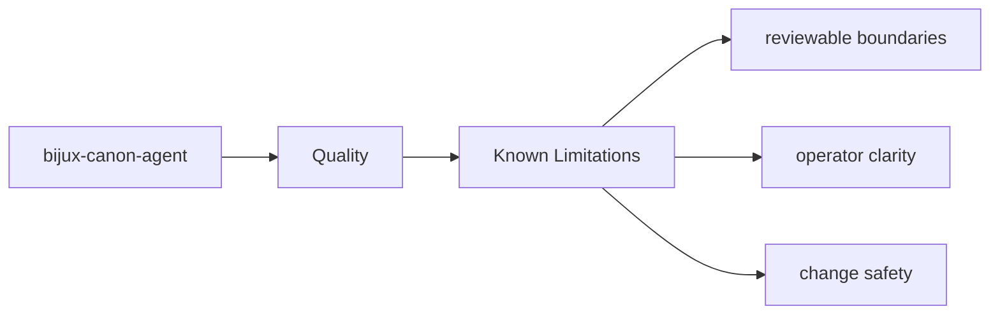
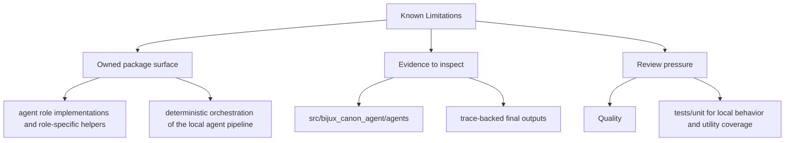

# Known Limitations

No package is improved by pretending its limitations do not exist.

## Page Maps

## Honest Boundaries

- runtime-wide persistence and replay acceptance
- ingest and index domain ownership
- repository tooling and release automation

## Purpose

This page keeps limitation language attached to the package boundary instead of scattered through issue comments.

## Stability

Keep it aligned with the limitations that remain intentionally true today.
