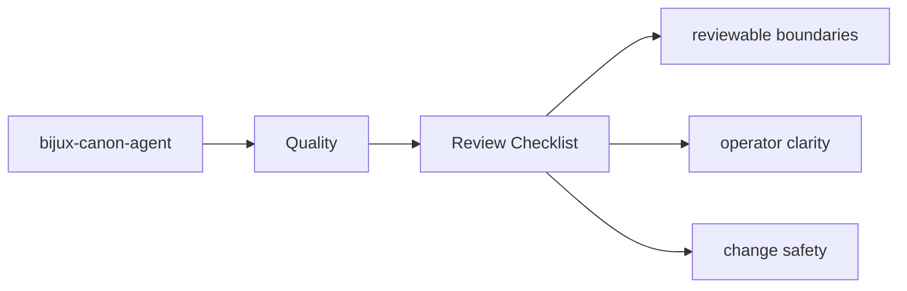
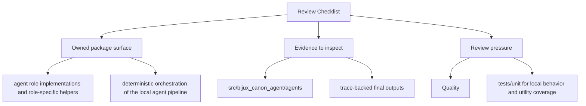

# Review Checklist

Reviewing changes in `bijux-canon-agent` should include both behavior and documentation.

## Page Maps

## Checklist

- did ownership stay inside the correct package boundary
- do interface or artifact changes have matching docs and tests
- are filenames, commit messages, and symbols still clear enough to age well

## Use This Page When

- you are reviewing tests, invariants, limitations, or risk
- you need evidence that the documented contract is actually protected
- you are deciding whether a change is done rather than merely implemented

## What This Page Answers

- what proves the bijux-canon-agent contract today
- which risks or limits still need explicit review
- what a reviewer should verify before accepting change

## Reviewer Lens

- compare the documented proof strategy with the current test layout
- look for limitations or risks that should have been updated by recent changes
- verify that the page's definition of done still reflects real validation practice

## Purpose

This page records a compact review lens for package changes.

## Stability

Update it only when the package review posture genuinely changes.
