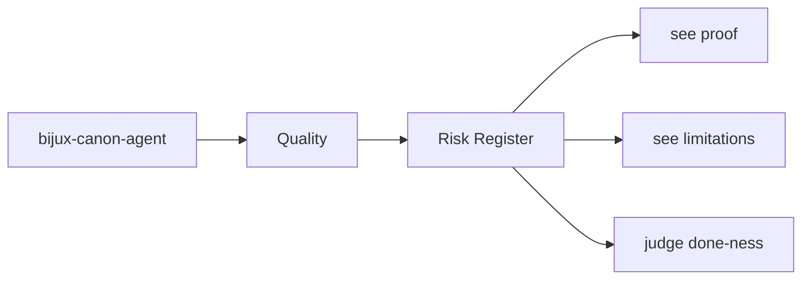
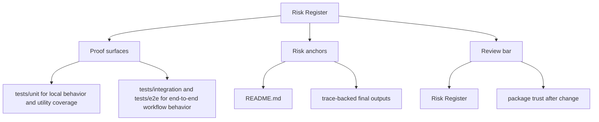

# Risk Register

The durable risks for `bijux-canon-agent` are the ones that make the package boundary, interface contract,
or produced artifacts harder to trust.

This page should keep long-lived risk language attached to the package instead
of scattering it across reviews and memory. The goal is not alarmism; it is to
help maintainers remember which failures would actually cost credibility.

Read the quality pages for `bijux-canon-agent` as the proof frame around the package. They should explain how trust is earned, how risk stays visible, and why a passing local check is not always enough.

## Page Maps

## Ongoing Risks to Watch

- hidden overlap with neighboring packages
- drift between docs, code, and tests
- compatibility changes that are not made explicit

## Concrete Anchors

- tests/unit for local behavior and utility coverage
- tests/integration and tests/e2e for end-to-end workflow behavior
- README.md

## Use This Page When

- you are reviewing tests, invariants, limitations, or ongoing risks
- you need evidence that the documented contract is actually defended
- you are deciding whether a change is truly done rather than merely implemented

## Decision Rule

Use `Risk Register` to decide whether `bijux-canon-agent` has actually earned trust after a change. If one narrow green check hides a wider contract, risk, or validation gap, the work is not done yet.

## What This Page Answers

- what currently proves the `bijux-canon-agent` contract instead of merely describing it
- which risks, limits, and assumptions still need explicit skepticism
- what a reviewer should be able to say before accepting a change as done

## Reviewer Lens

- compare the documented proof story with the actual test layout and release posture
- look for limitations or risks that should have moved with recent behavior changes
- verify that the claimed done-ness standard still reflects real validation practice

## Honesty Boundary

This page explains how `bijux-canon-agent` is supposed to earn trust, but it does not claim that prose alone is enough. If the listed tests, checks, and review practice stop backing the story, the story has to change.

## Next Checks

- move to foundation when the risk appears to be boundary confusion rather than missing tests
- move to architecture when the proof gap points to structural drift
- move to interfaces or operations when the proof question is really about a contract or workflow

## Purpose

This page keeps long-lived package risks visible to maintainers.

## Stability

Update it when the durable risk profile changes, not for routine day-to-day churn.
