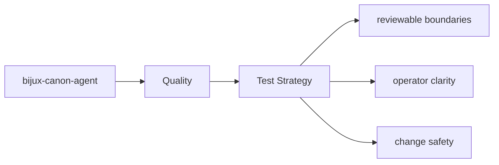

# Test Strategy

The tests for `bijux-canon-agent` are the executable proof of its package contract.

## Page Maps

## Test Areas

- tests/unit for local behavior and utility coverage
- tests/integration and tests/e2e for end-to-end workflow behavior
- tests/invariants for package promises that should not drift
- tests/api for HTTP-facing validation

## Purpose

This page explains the broad testing shape of the package.

## Stability

Keep it aligned with the real test directories and the behaviors they protect.
