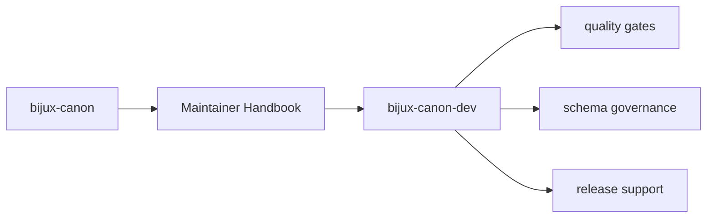
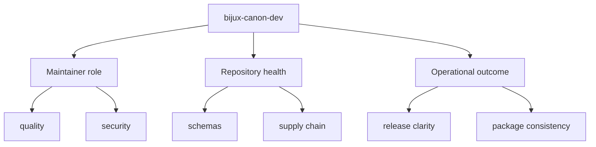

# bijux-canon-dev

`bijux-canon-dev` is the maintainer package for repository health. It exists so
quality gates, schema drift checks, SBOM generation, and release support have a
clear home that is outside the end-user product surface.

## Page Maps

## Pages in This Section

- [Package Overview](package-overview.md)
- [Scope and Non-Goals](scope-and-non-goals.md)
- [Module Map](module-map.md)
- [Quality Gates](quality-gates.md)
- [Security Gates](security-gates.md)
- [Schema Governance](schema-governance.md)
- [Release Support](release-support.md)
- [SBOM and Supply Chain](sbom-and-supply-chain.md)
- [Operating Guidelines](operating-guidelines.md)

## Module Map

- `src/bijux_canon_dev/quality` for repository quality checks
- `src/bijux_canon_dev/security` for security gates
- `src/bijux_canon_dev/sbom` for supply-chain and bill-of-materials support
- `src/bijux_canon_dev/release` for release support
- `src/bijux_canon_dev/api` for OpenAPI and schema drift tooling
- `src/bijux_canon_dev/packages` for package-specific repository helpers

## Concrete Anchors

- `packages/bijux-canon-dev/src/bijux_canon_dev` for maintainer helpers
- `packages/bijux-canon-dev/tests` for executable maintenance proof
- `apis/` and root workflows for repository-level integration points

## Use This Page When

- you are changing repository automation, validation, or release support
- you need maintainer-only context that should not live in product package docs
- you are reviewing CI, schema drift, or supply-chain behavior

## What This Page Answers

- which repository maintenance concern this page explains
- which maintainer modules or tests support that concern
- what a reviewer should confirm before changing repository automation

## Reviewer Lens

- compare the described maintainer behavior with the actual helper modules and tests
- check that maintainer-only guidance has not leaked into product-facing pages
- confirm that repository automation still names its package impact explicitly

## Honesty Boundary

This section can describe maintainer automation and repository health work, but it should never imply that maintainer tooling is part of the end-user product surface.

## Section Contract

- explain repository maintenance behavior without turning it into product documentation
- tie maintainer claims to helper modules, tests, and workflows
- keep automation boundaries explicit enough to review safely

## Reading Advice

- start here when the change affects CI, release support, schema drift, or repository health checks
- return to product package docs when the issue is user-facing behavior
- use this section to separate maintainer intent from runtime intent

## Purpose

This page explains how to use the maintainer handbook without confusing it with user-facing product docs.

## Stability

Keep this page aligned with the actual maintainer modules that exist under `packages/bijux-canon-dev`.

## Core Claim

Each maintainer page should explain repository-health behavior in a way that is explicit, testable, and clearly separate from end-user product behavior.

## Why It Matters

Maintainer pages matter because hidden automation is one of the fastest ways for a monorepo to become hard to trust, hard to change, and hard to release safely.
