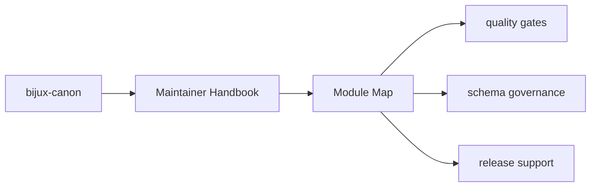
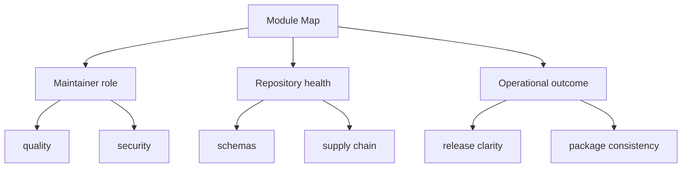

# Module Map

- `src/bijux_canon_dev/quality` for repository quality checks
- `src/bijux_canon_dev/security` for security gates
- `src/bijux_canon_dev/sbom` for supply-chain and bill-of-materials support
- `src/bijux_canon_dev/release` for release support
- `src/bijux_canon_dev/api` for OpenAPI and schema drift tooling
- `src/bijux_canon_dev/packages` for package-specific repository helpers

These maintainer pages should read like explicit operational memory for repository-health work. They are strongest when they reduce hidden automation and make package-wide maintenance effects inspectable.

## Page Maps

## Concrete Anchors

- `packages/bijux-canon-dev/src/bijux_canon_dev` for maintainer helpers
- `packages/bijux-canon-dev/tests` for executable maintenance proof
- `apis/` and root workflows for repository-level integration points

## Use This Page When

- you are changing repository automation, validation, or release support
- you need maintainer-only context that should not live in product package docs
- you are reviewing CI, schema drift, or supply-chain behavior

## Decision Rule

Use `Module Map` to decide whether a change belongs to maintainer automation or to a product package contract. If the change would affect end-user behavior directly, this page should push the review back toward the owning product package instead of letting maintainer scope sprawl.

## What This Page Answers

- which repository maintenance concern this page explains
- which maintainer modules or tests support that concern
- what a reviewer should confirm before changing repository automation

## Reviewer Lens

- compare the described maintainer behavior with the actual helper modules and tests
- check that maintainer-only guidance has not leaked into product-facing pages
- confirm that repository automation still names its package impact explicitly

## Next Checks

- move to product package docs if the question is user-facing behavior rather than repository health
- open the relevant helper module or test after using this page to orient yourself
- return to repository handbook pages when the maintainer issue turns out to be root policy instead

## Update This Page When

- maintainer helpers, tests, or CI integrations change materially
- repository-health work moves across package boundaries
- the section stops matching the actual maintainer-only operating model

## Honesty Boundary

This section can describe maintainer automation and repository health work, but it should never imply that maintainer tooling is part of the end-user product surface.

## Purpose

This page is the shortest code-navigation aid for `bijux-canon-dev`.

## Stability

Keep it aligned with actual package modules and remove retired directories promptly.

## Core Claim

Each maintainer page should explain repository-health behavior in a way that is explicit, testable, and clearly separate from end-user product behavior.

## Why It Matters

Maintainer pages matter because hidden automation is one of the fastest ways for a monorepo to become hard to trust, hard to change, and hard to release safely.

## If It Drifts

- maintainer-only behavior becomes harder to discover before it surprises a contributor
- repository automation changes without a stable explanation of its intent
- product docs get polluted with infrastructure concerns that belong elsewhere

## Representative Scenario

A CI or release helper changes behavior and a contributor needs to know whether the effect is repository maintenance only or whether it changes a product package contract. This section should make that distinction fast.

## Source Of Truth Order

- `packages/bijux-canon-dev/src/bijux_canon_dev` for implemented maintainer helpers
- `packages/bijux-canon-dev/tests` for executable proof of maintainer behavior
- this section for the maintained explanation of maintainer intent

## Common Misreadings

- that maintainer automation belongs in product package docs
- that CI behavior is self-explanatory without maintainer documentation
- that repository-health tools are part of the public runtime product surface
