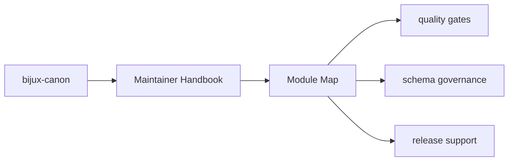

# Module Map

- `src/bijux_canon_dev/quality` for repository quality checks
- `src/bijux_canon_dev/security` for security gates
- `src/bijux_canon_dev/sbom` for supply-chain and bill-of-materials support
- `src/bijux_canon_dev/release` for release support
- `src/bijux_canon_dev/api` for OpenAPI and schema drift tooling
- `src/bijux_canon_dev/packages` for package-specific repository helpers

## Page Maps

## Purpose

This page is the shortest code-navigation aid for `bijux-canon-dev`.

## Stability

Keep it aligned with actual package modules and remove retired directories promptly.
