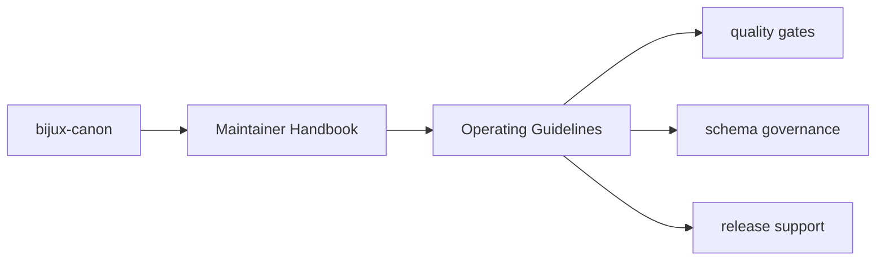

# Operating Guidelines

Changes in `bijux-canon-dev` should be especially careful because they can
affect multiple packages at once.

## Page Maps

## Guidelines

- prefer checks that are reviewable and testable over opaque shell glue
- keep repository automation explicit about which packages it touches
- document maintainer-only behavior in this section rather than in user-facing package pages

## Purpose

This page records the expected maintenance posture for the package.

## Stability

Update these guidelines only when the repository operating model genuinely changes.
