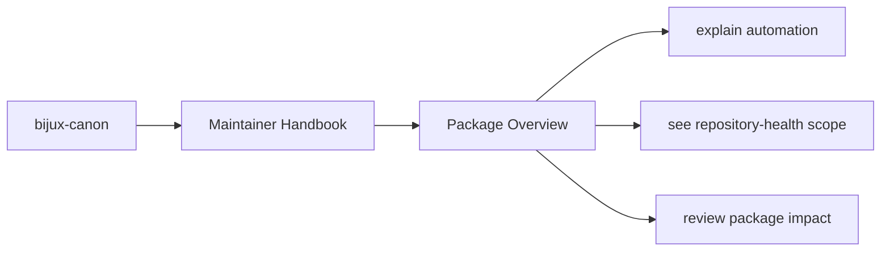
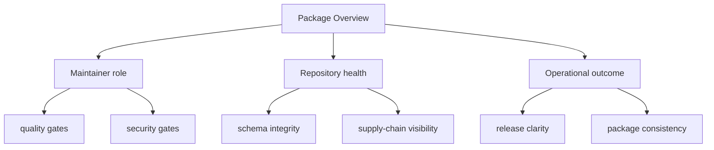

# Package Overview

`bijux-canon-dev` is intentionally not part of the end-user runtime. It is
the package that keeps the monorepo honest when schemas drift, security
tooling falls behind, or release metadata becomes inconsistent.

A good maintainer package should reduce mystery, not create a new layer of
it. This page should help readers see why the automation exists and why it
does not belong in the product packages themselves.

These maintainer pages should read like explicit operational memory for repository-health work. They are strongest when they expose automation intent, package impact, and repository policy without pretending that CI logs are documentation.

## Page Maps

## What It Owns

- shared quality and security helpers used across packages
- release, versioning, and SBOM helpers
- OpenAPI and schema drift tooling
- package-specific maintenance helpers invoked by root automation

## Concrete Anchors

- `packages/bijux-canon-dev/src/bijux_canon_dev` for maintainer helpers
- `packages/bijux-canon-dev/tests` for executable maintenance proof
- `apis/` and root workflows for repository-level integration points

## Use This Page When

- you are changing repository automation, validation, or release support
- you need maintainer-only context that should not live in product package docs
- you are reviewing CI, schema drift, or supply-chain behavior

## Decision Rule

Use `Package Overview` to decide whether a change belongs to maintainer automation or to a product package contract. If the change would affect end-user behavior directly, this page should push the review back toward the owning product package instead of letting maintainer scope sprawl.

## What This Page Answers

- which repository maintenance concern this page explains
- which maintainer modules or tests support that concern
- what a reviewer should confirm before changing repository automation

## Reviewer Lens

- compare the described maintainer behavior with the actual helper modules and tests
- check that maintainer-only guidance has not leaked into product-facing pages
- confirm that repository automation still names its package impact explicitly

## Next Checks

- move to product package docs if the question is user-facing behavior rather than repository health
- open the relevant helper module or test after using this page to orient yourself
- return to repository handbook pages when the maintainer issue turns out to be root policy instead

## Update This Page When

- maintainer helpers, tests, or CI integrations change materially
- repository-health work moves across package boundaries
- the section stops matching the actual maintainer-only operating model

## Honesty Boundary

This section can describe maintainer automation and repository health work, but it should never imply that maintainer tooling is part of the end-user product surface. It also should not pretend that hidden scripts count as documentation just because CI happens to run them.

## Purpose

This page gives the shortest honest description of why the package exists.

## Stability

Keep this page aligned with real maintainer behavior, not aspirational tooling that does not yet exist.

## What Good Looks Like

Use these points as the fast check for whether the page is doing real explanatory work.

- `Package Overview` makes maintainer-only behavior explicit enough that it does not surprise contributors
- the page distinguishes repository-health work from runtime product behavior cleanly
- automation intent stays understandable without digging through CI and helpers first

## Failure Signals

These are the quickest signs that the page is drifting from honest explanation into noise or stale certainty.

- `Package Overview` starts reading like product documentation instead of maintainer guidance
- contributors can only discover maintainer behavior by reading scripts or CI output directly
- the page stops making package impact explicit when automation changes

## Tradeoffs To Hold

A strong page names the tensions it is managing instead of pretending every desirable goal improves together.

- prefer repository-health clarity over convenience that only helps one maintainer's local workflow
- prefer checked-in automation expectations over undocumented operator heroics
- prefer explicit maintainer scope over letting dev pages quietly absorb product-contract decisions

## Cross Implications

- maintainer ambiguity leaks quickly into product package docs and repository workflows
- release and validation pressure becomes harder to reason about across the monorepo
- root governance pages become less actionable when maintainer intent is implicit

## Approval Questions

A reviewer should be able to answer these clearly before trusting the page or the change it is helping to explain.

- does the page still describe maintainer scope rather than end-user runtime behavior
- can contributors inspect the named automation, tests, or helpers that support the page
- is the product-package impact explicit enough that maintainers are not making contract changes by accident

## Evidence Checklist

Check these assets before trusting the prose. They are the concrete places where the page either holds up or falls apart.

- inspect the named helper modules under `packages/bijux-canon-dev/src/bijux_canon_dev`
- check the corresponding maintainer tests before trusting the page's operational claims
- confirm which product packages are affected so maintainer scope stays explicit

## Anti-Patterns

These patterns make documentation feel fuller while quietly making it less clear, less honest, or less durable.

- describing maintainer automation as if it were part of the end-user runtime
- letting CI behavior become the only place where maintainer intent is visible
- changing repository-health tools without updating the maintainer story they imply

## Escalate When

These conditions mean the problem is larger than a local wording fix and needs a wider review conversation.

- a maintainer-only change starts affecting product package contracts directly
- the page can no longer describe scope without referencing multiple package ownership changes
- repository-health automation now requires a wider root policy decision

## Core Claim

Each maintainer page should explain repository-health behavior in a way that is explicit, testable, and clearly separate from end-user product behavior.

## Why It Matters

Maintainer pages matter because hidden automation is one of the fastest ways for a monorepo to become hard to trust, hard to change, and hard to release safely. If the tooling is powerful but unexplained, contributors start treating the repository like a trap.

## If It Drifts

- maintainer-only behavior becomes harder to discover before it surprises a contributor
- repository automation changes without a stable explanation of its intent
- product docs get polluted with infrastructure concerns that belong elsewhere

## Representative Scenario

A CI or release helper changes behavior and a contributor needs to know whether the effect is repository maintenance only or whether it changes a product package contract. This section should make that distinction fast.

## Source Of Truth Order

- `packages/bijux-canon-dev/src/bijux_canon_dev` for implemented maintainer helpers
- `packages/bijux-canon-dev/tests` for executable proof of maintainer behavior
- this section for the maintained explanation of maintainer intent

## Common Misreadings

- that maintainer automation belongs in product package docs
- that CI behavior is self-explanatory without maintainer documentation
- that repository-health tools are part of the public runtime product surface
