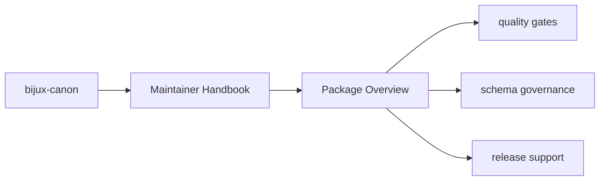

# Package Overview

`bijux-canon-dev` is intentionally not part of the end-user runtime. It is the
package that keeps the monorepo honest when schemas drift, security tooling
falls behind, or release metadata becomes inconsistent.

## Page Maps

## What It Owns

- shared quality and security helpers used across packages
- release, versioning, and SBOM helpers
- OpenAPI and schema drift tooling
- package-specific maintenance helpers invoked by root automation

## Purpose

This page gives the shortest honest description of why the package exists.

## Stability

Keep this page aligned with real maintainer behavior, not aspirational tooling that does not yet exist.
