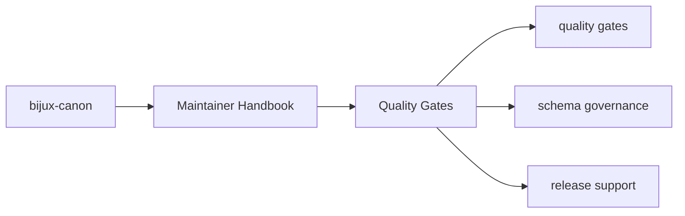
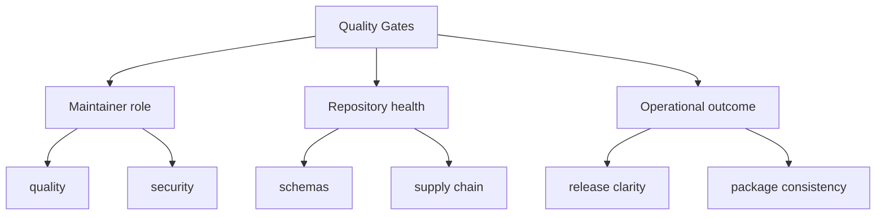

# Quality Gates

Repository quality checks live here so package code does not each reinvent the
same maintenance logic.

## Page Maps

## Current Quality Surfaces

- dependency analysis in `quality/deptry_scan.py`
- package-specific checks under `packages/`
- root test coverage through `packages/bijux-canon-dev/tests`

## What This Page Answers

- which repository maintenance concern this page explains
- which maintainer modules or tests support that concern
- what a reviewer should confirm before changing repository automation

## Purpose

This page explains how the package participates in repository-wide correctness and consistency.

## Stability

Keep it aligned with the actual quality checks that run in tests or CI.
