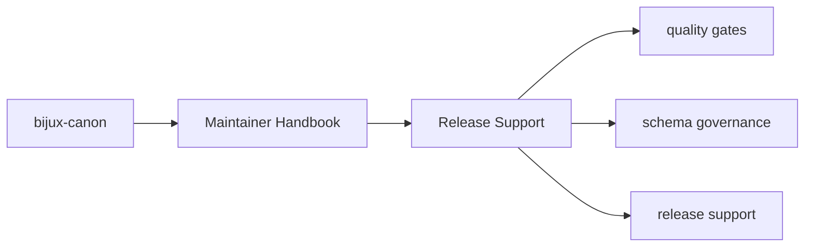
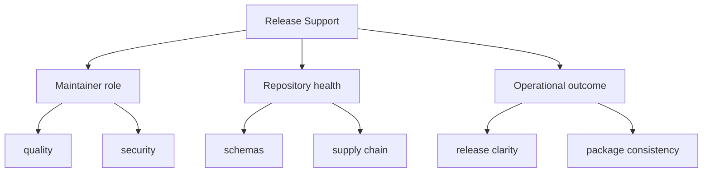

# Release Support

Shared release helpers belong here so versioning and packaging practices stay
consistent across the repository.

## Page Maps

## Current Surfaces

- `release/version_resolver.py`
- package metadata checks in tests
- root commit conventions configured through commitizen

## Purpose

This page records the maintenance package role in release preparation.

## Stability

Keep it aligned with the real release support code and the actual versioning workflow.
