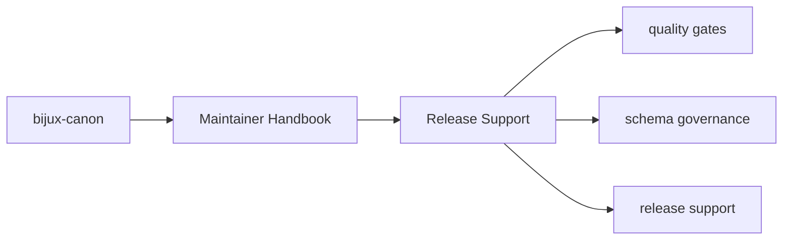
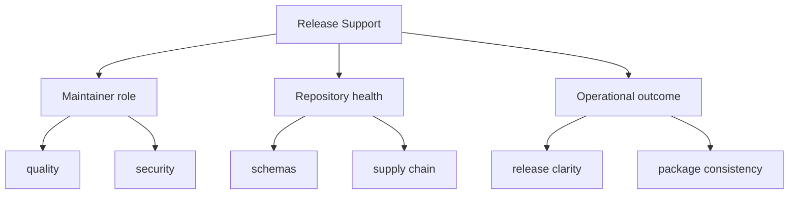

# Release Support

Shared release helpers belong here so versioning and packaging practices stay
consistent across the repository.

## Page Maps

## Current Surfaces

- `release/version_resolver.py`
- package metadata checks in tests
- root commit conventions configured through commitizen

## Use This Page When

- you are changing repository automation, validation, or release support
- you need maintainer-only context that should not live in product package docs
- you are reviewing CI, schema drift, or supply-chain behavior

## What This Page Answers

- which repository maintenance concern this page explains
- which maintainer modules or tests support that concern
- what a reviewer should confirm before changing repository automation

## Reviewer Lens

- compare the described maintainer behavior with the actual helper modules and tests
- check that maintainer-only guidance has not leaked into product-facing pages
- confirm that repository automation still names its package impact explicitly

## Honesty Boundary

This section can describe maintainer automation and repository health work, but it should never imply that maintainer tooling is part of the end-user product surface.

## Purpose

This page records the maintenance package role in release preparation.

## Stability

Keep it aligned with the real release support code and the actual versioning workflow.
