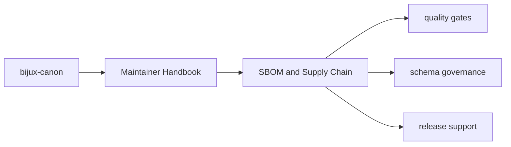
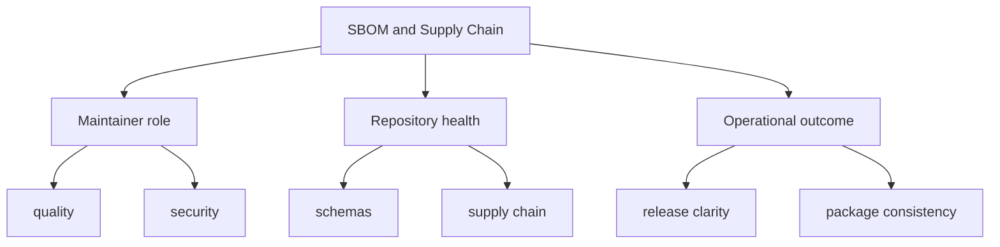

# SBOM and Supply Chain

Supply-chain visibility is a repository maintenance concern, so SBOM helpers
live in `bijux-canon-dev` instead of being duplicated by each package.

## Page Maps

## Current Surfaces

- `sbom/requirements_writer.py`
- `tests/test_sbom_requirements_writer.py`
- shared dependency metadata in package `pyproject.toml` files

## Concrete Anchors

- `packages/bijux-canon-dev/src/bijux_canon_dev` for maintainer helpers
- `packages/bijux-canon-dev/tests` for executable maintenance proof
- `apis/` and root workflows for repository-level integration points

## Use This Page When

- you are changing repository automation, validation, or release support
- you need maintainer-only context that should not live in product package docs
- you are reviewing CI, schema drift, or supply-chain behavior

## What This Page Answers

- which repository maintenance concern this page explains
- which maintainer modules or tests support that concern
- what a reviewer should confirm before changing repository automation

## Reviewer Lens

- compare the described maintainer behavior with the actual helper modules and tests
- check that maintainer-only guidance has not leaked into product-facing pages
- confirm that repository automation still names its package impact explicitly

## Honesty Boundary

This section can describe maintainer automation and repository health work, but it should never imply that maintainer tooling is part of the end-user product surface.

## Purpose

This page explains the home for supply-chain oriented repository tooling.

## Stability

Keep it aligned with the checked-in SBOM helpers and tests.
