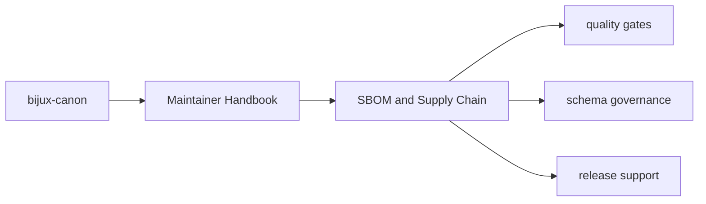

# SBOM and Supply Chain

Supply-chain visibility is a repository maintenance concern, so SBOM helpers
live in `bijux-canon-dev` instead of being duplicated by each package.

## Page Maps

## Current Surfaces

- `sbom/requirements_writer.py`
- `tests/test_sbom_requirements_writer.py`
- shared dependency metadata in package `pyproject.toml` files

## Purpose

This page explains the home for supply-chain oriented repository tooling.

## Stability

Keep it aligned with the checked-in SBOM helpers and tests.
