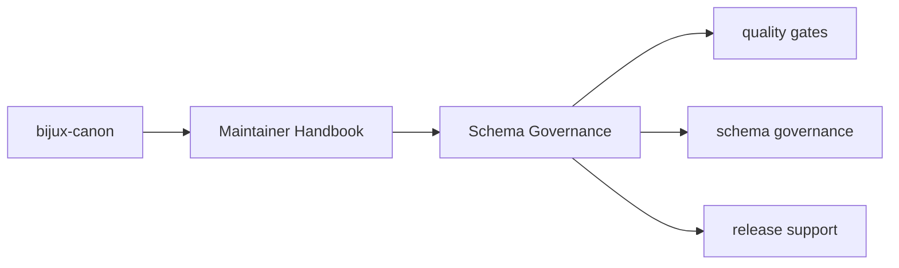

# Schema Governance

The package owns repository-level helpers that keep API schemas and tracked
schema artifacts synchronized with the code that claims to implement them.

## Page Maps

## Current Surfaces

- `api/openapi_drift.py`
- tests such as `tests/test_openapi_drift.py`
- root `apis/` directories that store reviewed schema artifacts

## Purpose

This page explains why schema drift detection belongs in the maintainer package.

## Stability

Keep it aligned with the actual drift tooling and tracked schema files.
