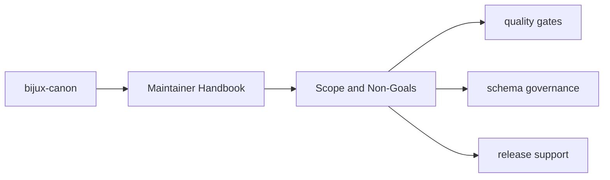

# Scope and Non-Goals

`bijux-canon-dev` is for maintainers and automation.

## Page Maps

## In Scope

- CI-facing helpers
- quality, security, SBOM, release, and schema checks
- package-specific repository automation

## Out of Scope

- user-facing runtime behavior
- product-domain models that belong to canonical packages
- legacy-name compatibility shims

## Purpose

This page prevents maintenance code from becoming an unbounded dumping ground.

## Stability

Update this page only when ownership truly moves into or out of the maintenance package.
