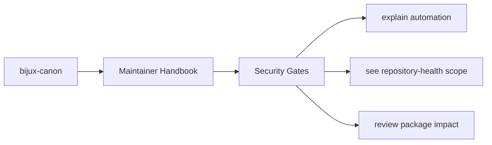
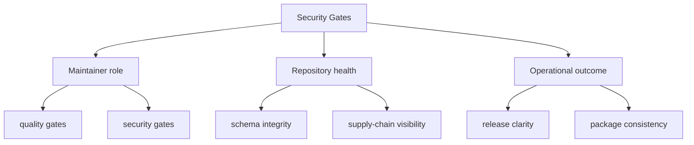

# Security Gates

Security checks that are about repository health rather than product behavior
live in `bijux-canon-dev`.

This page is here to keep security work from becoming vague compliance
theater. The useful question is always which checked-in tool or test is
carrying the actual security expectation.

These maintainer pages should read like explicit operational memory for repository-health work. They are strongest when they expose automation intent, package impact, and repository policy without pretending that CI logs are documentation.

## Page Maps

## Current Security Surfaces

- `security/pip_audit_gate.py`
- package tests that confirm expected security tooling behavior
- CI integration through root workflows

## Concrete Anchors

- `packages/bijux-canon-dev/src/bijux_canon_dev` for maintainer helpers
- `packages/bijux-canon-dev/tests` for executable maintenance proof
- `apis/` and root workflows for repository-level integration points

## Use This Page When

- you are changing repository automation, validation, or release support
- you need maintainer-only context that should not live in product package docs
- you are reviewing CI, schema drift, or supply-chain behavior

## Decision Rule

Use `Security Gates` to decide whether a change belongs to maintainer automation or to a product package contract. If the change would affect end-user behavior directly, this page should push the review back toward the owning product package instead of letting maintainer scope sprawl.

## What This Page Answers

- which repository maintenance concern this page explains
- which maintainer modules or tests support that concern
- what a reviewer should confirm before changing repository automation

## Reviewer Lens

- compare the described maintainer behavior with the actual helper modules and tests
- check that maintainer-only guidance has not leaked into product-facing pages
- confirm that repository automation still names its package impact explicitly

## Next Checks

- move to product package docs if the question is user-facing behavior rather than repository health
- open the relevant helper module or test after using this page to orient yourself
- return to repository handbook pages when the maintainer issue turns out to be root policy instead

## Honesty Boundary

This section can describe maintainer automation and repository health work, but it should never imply that maintainer tooling is part of the end-user product surface. It also should not pretend that hidden scripts count as documentation just because CI happens to run them.

## Purpose

This page marks the boundary between maintenance security tooling and product runtime security behavior.

## Stability

Keep it aligned with the actual checks we can execute and verify.
