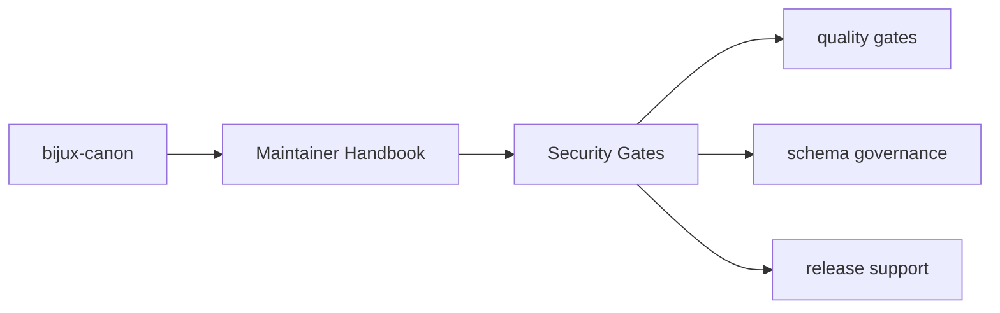
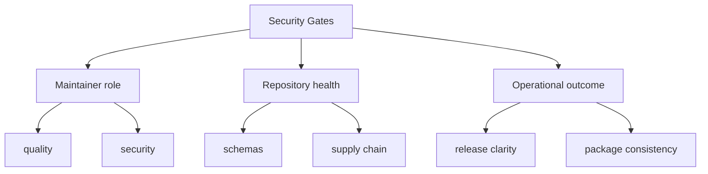

# Security Gates

Security checks that are about repository health rather than product behavior
live in `bijux-canon-dev`.

## Page Maps

## Current Security Surfaces

- `security/pip_audit_gate.py`
- package tests that confirm expected security tooling behavior
- CI integration through root workflows

## Use This Page When

- you are changing repository automation, validation, or release support
- you need maintainer-only context that should not live in product package docs
- you are reviewing CI, schema drift, or supply-chain behavior

## What This Page Answers

- which repository maintenance concern this page explains
- which maintainer modules or tests support that concern
- what a reviewer should confirm before changing repository automation

## Purpose

This page marks the boundary between maintenance security tooling and product runtime security behavior.

## Stability

Keep it aligned with the actual checks we can execute and verify.
