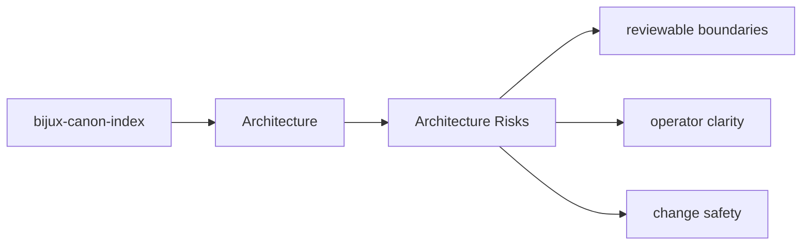

# Architecture Risks

Architectural risk appears when the package boundary becomes hard to explain or hard to test.

## Page Maps

## Risk Signals

- behavior moves into the wrong package because it seems convenient
- interfaces start depending on lower-level implementation details directly
- produced artifacts stop matching their documented contract

## Review Areas

- `src/bijux_canon_index/domain` for execution, provenance, and request semantics
- `src/bijux_canon_index/application` for workflow coordination
- `src/bijux_canon_index/infra` for backends, adapters, and runtime environment helpers
- `src/bijux_canon_index/interfaces` for CLI and operator-facing edges
- `src/bijux_canon_index/api` for HTTP application surfaces
- `src/bijux_canon_index/contracts` for stable contract definitions

## Purpose

This page keeps architectural review focused on durable package risks instead of transient churn.

## Stability

Keep it aligned with the package structure and known review concerns.
