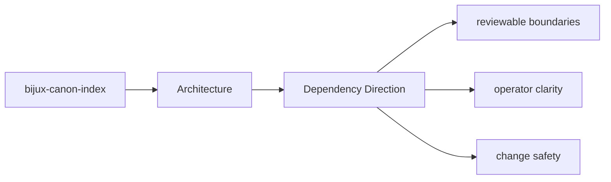

# Dependency Direction

The package should keep dependency direction readable: domain intent near the center,
interfaces and infrastructure at the edges.

## Page Maps

## Directional Reading Order

- domain and model concerns under the core module groups
- application orchestration that composes domain behavior
- interfaces, APIs, and adapters that sit at the boundary

## Concrete Anchors

- `src/bijux_canon_index/domain` for execution, provenance, and request semantics
- `src/bijux_canon_index/application` for workflow coordination
- `src/bijux_canon_index/infra` for backends, adapters, and runtime environment helpers
- `src/bijux_canon_index/interfaces` for CLI and operator-facing edges
- `src/bijux_canon_index/api` for HTTP application surfaces
- `src/bijux_canon_index/contracts` for stable contract definitions

## Purpose

This page makes dependency direction explicit enough to review during refactors.

## Stability

Keep it aligned with current imports and directory responsibilities.
