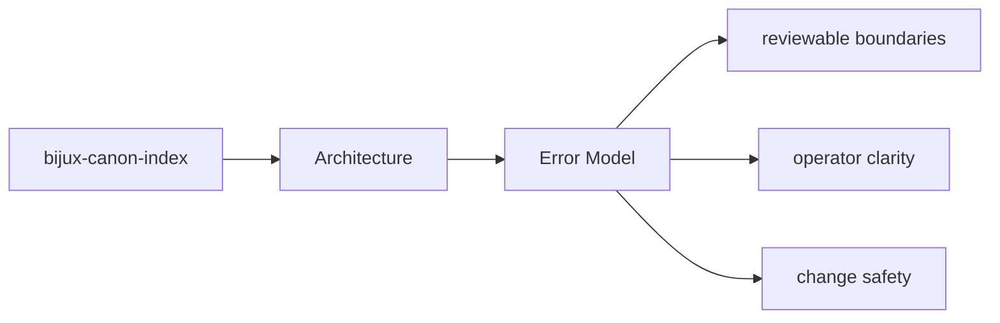

# Error Model

The package error model should make it clear which failures are local validation issues,
which are dependency failures, and which are contract violations.

## Page Maps

## Review Anchors

- inspect interface modules for operator-facing error shape
- inspect application and domain modules for orchestration failures
- inspect tests for the failure cases the package already protects

## Test Areas

- tests/unit for API, application, contracts, domain, infra, and tooling
- tests/e2e for CLI workflows, API smoke, determinism gates, and provenance gates
- tests/conformance and tests/compat_v01 for compatibility behavior
- tests/stress and tests/scenarios for operational pressure checks

## Purpose

This page records how to reason about failures in architecture review.

## Stability

Keep it aligned with the actual error-handling behavior and tests.
