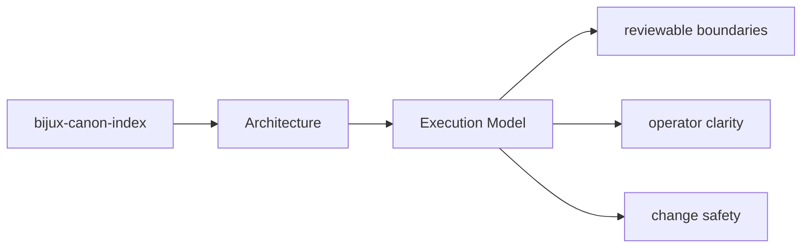

# Execution Model

`bijux-canon-index` executes work by receiving inputs at its interfaces, coordinating policy
and workflows in application code, and delegating specific responsibilities to owned modules.

## Page Maps

## Execution Anchors

- entry surfaces: CLI modules under src/bijux_canon_index/interfaces/cli, HTTP app under src/bijux_canon_index/api, OpenAPI schema files under apis/bijux-canon-index/v1
- workflow modules: src/bijux_canon_index/domain, src/bijux_canon_index/application, src/bijux_canon_index/infra
- outputs: vector execution result collections, provenance and replay comparison reports, backend-specific metadata and audit output

## Purpose

This page summarizes the package execution model before readers inspect individual modules.

## Stability

Keep it aligned with the actual workflow code and entrypoints.
