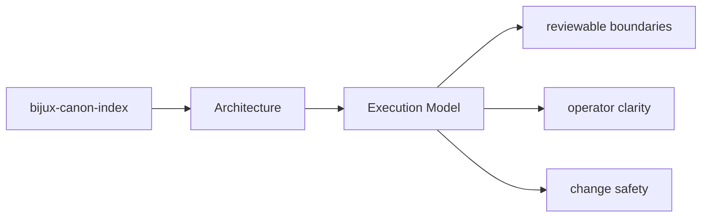
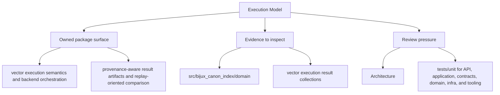

# Execution Model

`bijux-canon-index` executes work by receiving inputs at its interfaces, coordinating policy
and workflows in application code, and delegating specific responsibilities to owned modules.

## Page Maps

## Execution Anchors

- entry surfaces: CLI modules under src/bijux_canon_index/interfaces/cli, HTTP app under src/bijux_canon_index/api, OpenAPI schema files under apis/bijux-canon-index/v1
- workflow modules: src/bijux_canon_index/domain, src/bijux_canon_index/application, src/bijux_canon_index/infra
- outputs: vector execution result collections, provenance and replay comparison reports, backend-specific metadata and audit output

## Concrete Anchors

- `src/bijux_canon_index/domain` for execution, provenance, and request semantics
- `src/bijux_canon_index/application` for workflow coordination
- `src/bijux_canon_index/infra` for backends, adapters, and runtime environment helpers

## Use This Page When

- you are tracing internal structure or execution flow
- you need to understand where modules fit before refactoring
- you are reviewing architectural drift instead of one local bug

## What This Page Answers

- how bijux-canon-index is structured internally
- which modules control the main execution path
- where architectural drift would become visible first

## Reviewer Lens

- trace the claimed execution path through the listed modules
- look for dependency direction that now contradicts the documented seam
- verify that architectural risks still match the current code structure

## Honesty Boundary

This page describes the current structural model of bijux-canon-index, but it does not by itself prove that every import or runtime path still obeys that model.

## Purpose

This page summarizes the package execution model before readers inspect individual modules.

## Stability

Keep it aligned with the actual workflow code and entrypoints.

## Core Claim

The architectural claim of `bijux-canon-index` is that its structure is deliberate enough for a reviewer to trace responsibilities, dependencies, and drift pressure without reverse-engineering the entire codebase.

## Why It Matters

If the architecture pages for `bijux-canon-index` are weak, refactors become guesswork and dependency drift can hide until failures show up in tests or production-facing behavior.

## If It Drifts

- dependency direction becomes harder to inspect quickly
- refactors can land without anyone noticing structural regressions until later
- code navigation becomes slower because the documented map no longer matches reality
