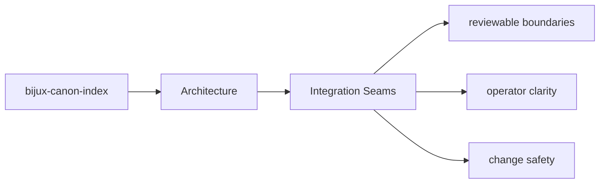

# Integration Seams

Integration seams are the points where `bijux-canon-index` meets configuration, APIs,
operators, or neighboring packages.

## Page Maps

## Integration Surfaces

- CLI modules under src/bijux_canon_index/interfaces/cli
- HTTP app under src/bijux_canon_index/api
- OpenAPI schema files under apis/bijux-canon-index/v1

## Adjacent Systems

- consumes prepared inputs from ingest-oriented flows
- is governed by bijux-canon-runtime for final replay acceptance

## Purpose

This page explains where to look when integration behavior changes.

## Stability

Keep it aligned with real boundary modules and schema files.
