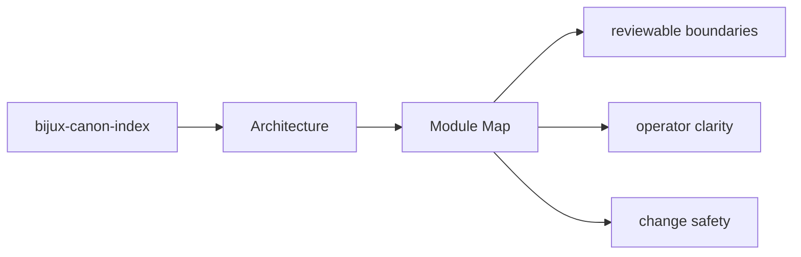

# Module Map

The architecture of `bijux-canon-index` is easiest to understand from the major module groups.

## Page Maps

## Major Modules

- `src/bijux_canon_index/domain` for execution, provenance, and request semantics
- `src/bijux_canon_index/application` for workflow coordination
- `src/bijux_canon_index/infra` for backends, adapters, and runtime environment helpers
- `src/bijux_canon_index/interfaces` for CLI and operator-facing edges
- `src/bijux_canon_index/api` for HTTP application surfaces
- `src/bijux_canon_index/contracts` for stable contract definitions

## Purpose

This page provides a shortest-path code map for the package.

## Stability

Keep it aligned with the actual source directories under `packages/bijux-canon-index`.
