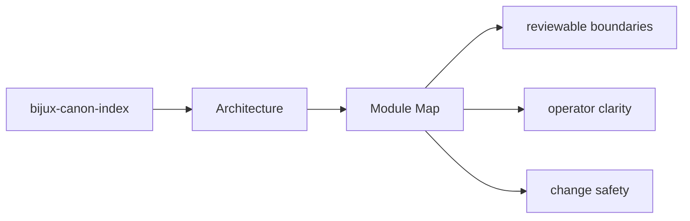
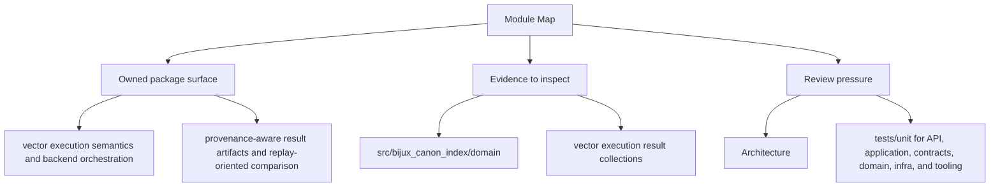

# Module Map

The architecture of `bijux-canon-index` is easiest to understand from the major module groups.

## Page Maps

## Major Modules

- `src/bijux_canon_index/domain` for execution, provenance, and request semantics
- `src/bijux_canon_index/application` for workflow coordination
- `src/bijux_canon_index/infra` for backends, adapters, and runtime environment helpers
- `src/bijux_canon_index/interfaces` for CLI and operator-facing edges
- `src/bijux_canon_index/api` for HTTP application surfaces
- `src/bijux_canon_index/contracts` for stable contract definitions

## Use This Page When

- you are tracing internal structure or execution flow
- you need to understand where modules fit before refactoring
- you are reviewing architectural drift instead of one local bug

## What This Page Answers

- how bijux-canon-index is structured internally
- which modules control the main execution path
- where architectural drift would become visible first

## Reviewer Lens

- trace the claimed execution path through the listed modules
- look for dependency direction that now contradicts the documented seam
- verify that architectural risks still match the current code structure

## Purpose

This page provides a shortest-path code map for the package.

## Stability

Keep it aligned with the actual source directories under `packages/bijux-canon-index`.
