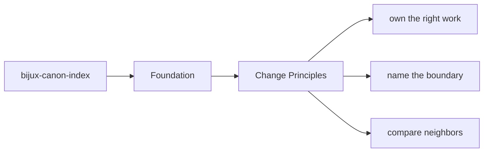
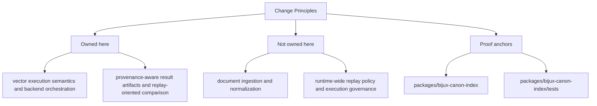

# Change Principles

Changes in `bijux-canon-index` should leave the package easier to explain, not
harder. A good change makes ownership clearer, contract language more honest,
and the proof story easier to follow.

These principles are not slogans. They are the filter for deciding whether a
local improvement is worth the long-term cost it creates for the rest of the
system.

Read the foundation pages for `bijux-canon-index` as the package's durable self-description. They should let a reader understand the package without needing to reconstruct its purpose from recent implementation history.

## Page Maps

## Principles

- prefer moving behavior toward the owning package instead of letting boundary overlap grow
- update docs and tests in the same change series that changes package behavior
- keep names stable and descriptive enough to survive years of maintenance

## Concrete Anchors

- `packages/bijux-canon-index` as the package root
- `packages/bijux-canon-index/src/bijux_canon_index` as the import boundary
- `packages/bijux-canon-index/tests` as the package proof surface

## Use This Page When

- you need the package idea before the implementation detail
- you are deciding whether work belongs here or in a neighboring package
- you want the shortest honest explanation of what this package is for

## Decision Rule

Use `Change Principles` to decide whether a change makes `bijux-canon-index` easier or harder to defend as a bounded package. If the work expands package authority without making ownership clearer, stop and re-check the boundary before treating the change as a local improvement.

## Next Checks

- move to architecture when the question becomes structural rather than boundary-oriented
- move to interfaces when the question becomes contract-facing
- move to quality when the question becomes proof or review sufficiency

## Update This Page When

- package ownership moves between this package and a neighboring one
- the package description, core outputs, or boundary modules materially change
- tests or docs reveal that the old boundary explanation is no longer accurate

## What This Page Answers

- what problem `bijux-canon-index` is supposed to own on purpose
- where the package boundary stops, even when nearby code looks tempting
- which neighboring package seams deserve comparison before the boundary is changed

## Reviewer Lens

- compare the stated boundary with the modules, artifacts, and tests that are supposed to uphold it
- check that out-of-scope behavior is not quietly re-entering through convenience paths
- confirm that the package story still matches the real repository layout and neighboring package docs

## Honesty Boundary

This page can explain the intended boundary of `bijux-canon-index`, but it cannot prove that boundary by itself. The real proof still lives in the code, tests, and neighboring package seams that either support or contradict the story told here.

## Purpose

This page records the package-specific contribution posture.

## Stability

Update these principles only when the package operating model truly changes.

## What Good Looks Like

Use these points as the fast check for whether the page is doing real explanatory work.

- `Change Principles` leaves a reviewer able to explain `bijux-canon-index` in one boundary sentence without hand-waving
- the owned and out-of-scope areas read as complementary rather than contradictory
- neighboring packages become easier to place because this package is clearly bounded

## Failure Signals

These are the quickest signs that the page is drifting from honest explanation into noise or stale certainty.

- `Change Principles` has to explain the same ownership claim with repeated exceptions
- the out-of-scope list starts looking like shadow ownership instead of a real boundary
- review conversations keep falling back to package adjacency rather than package intent

## Tradeoffs To Hold

A strong page names the tensions it is managing instead of pretending every desirable goal improves together.

- prefer clean ownership over local convenience, even when nearby code looks easier to reuse
- prefer an explicit boundary gap over a shadow responsibility that no package clearly owns
- prefer keeping `bijux-canon-index` intelligible as a bounded package over making it look universally useful

## Cross Implications

- changes here influence how neighboring packages are allowed to stay narrow around `bijux-canon-index`
- a weak boundary explanation raises architectural and quality ambiguity immediately
- interface and operations pages inherit confusion when foundational ownership is unclear

## Approval Questions

A reviewer should be able to answer these clearly before trusting the page or the change it is helping to explain.

- does `Change Principles` still let a reviewer state `bijux-canon-index` ownership in one clear sentence
- does the change preserve package boundaries without creating shadow scope in a neighbor
- is there concrete code and test evidence behind the boundary claim, or only persuasive prose

## Evidence Checklist

Check these assets before trusting the prose. They are the concrete places where the page either holds up or falls apart.

- read the owned module roots under `packages/bijux-canon-index/src/bijux_canon_index` with the boundary statement in mind
- inspect `packages/bijux-canon-index/tests` for proof that the boundary is enforced instead of merely described
- check whether adjacent package docs now tell a conflicting ownership story

## Anti-Patterns

These patterns make documentation feel fuller while quietly making it less clear, less honest, or less durable.

- using package adjacency as a substitute for package ownership
- letting boundary exceptions accumulate until they become the real rule
- writing boundary prose that cannot be checked against code or tests

## Escalate When

These conditions mean the problem is larger than a local wording fix and needs a wider review conversation.

- the page can no longer explain ownership without repeated cross-package caveats
- a change proposal would shift authority between packages rather than stay local
- tests and docs disagree on who is supposed to own the behavior

## Core Claim

The core foundational claim of `bijux-canon-index` is that its ownership can be explained as a deliberate package boundary, not as an accident of where code happened to accumulate.

## Why It Matters

If the foundation pages for `bijux-canon-index` are weak, reviewers stop knowing where the package really begins and ends. Adjacent packages then absorb behavior by convenience instead of by design.

## If It Drifts

- ownership starts migrating by convenience instead of by explicit package boundary
- neighboring packages inherit responsibilities without deliberate review
- reviewers lose confidence that the package description still means anything stable

## Representative Scenario

A contributor proposes moving new behavior into `bijux-canon-index` because it is nearby in the repository. This page should make it obvious whether that work fits the package boundary or belongs in a neighboring package instead.

## Source Of Truth Order

- `packages/bijux-canon-index/src/bijux_canon_index` for the real ownership boundary in code
- `packages/bijux-canon-index/tests` for executable proof that the boundary still holds under change
- `packages/bijux-canon-index/README.md` plus this section for the shortest maintained explanation of that boundary

## Common Misreadings

- that `bijux-canon-index` owns any nearby behavior just because it would be convenient
- that a boundary statement is enough even when code and tests tell a different story
- that out-of-scope means unimportant rather than intentionally owned elsewhere
