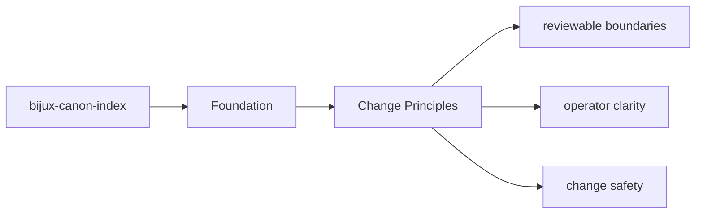
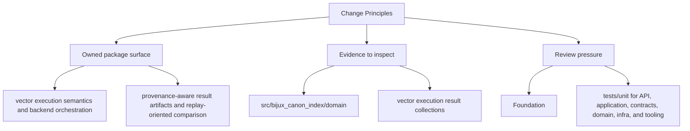

# Change Principles

Changes in `bijux-canon-index` should keep the package boundary easier to understand, not harder.

Read the foundation pages for `bijux-canon-index` as the package's durable self-description: they should explain the package in terms that remain intelligible even after ordinary refactors.

## Page Maps

## Principles

- prefer moving behavior toward the owning package instead of letting boundary overlap grow
- update docs and tests in the same change series that changes package behavior
- keep names stable and descriptive enough to survive years of maintenance

## Concrete Anchors

- `packages/bijux-canon-index` as the package root
- `packages/bijux-canon-index/src/bijux_canon_index` as the import boundary
- `packages/bijux-canon-index/tests` as the package proof surface

## Use This Page When

- you need the package boundary before reading implementation detail
- you are deciding whether work belongs in this package or a neighboring one
- you need the shortest stable description of package intent

## Decision Rule

Use `Change Principles` to decide whether a change clarifies or blurs `bijux-canon-index` as a bounded package. If the work expands package authority without a cleaner ownership story, the default answer should be to stop and re-check the boundary before implementation continues.

## Next Checks

- move to architecture when the question becomes structural rather than boundary-oriented
- move to interfaces when the question becomes contract-facing
- move to quality when the question becomes proof or review sufficiency

## Update This Page When

- package ownership moves between this package and a neighboring one
- the package description, core outputs, or boundary modules materially change
- tests or docs reveal that the old boundary explanation is no longer accurate

## What This Page Answers

- what bijux-canon-index is expected to own
- what remains outside the package boundary
- which neighboring seams a reviewer should compare next

## Reviewer Lens

- compare the stated package boundary with the owned modules and tests
- check that out-of-scope work is not quietly reintroduced through adjacent packages
- confirm that the package description still matches the real repository layout

## Honesty Boundary

This page can explain the intended boundary of bijux-canon-index, but it does not replace the code and tests that ultimately prove that boundary.

## Purpose

This page records the package-specific contribution posture.

## Stability

Update these principles only when the package operating model truly changes.

## What Good Looks Like

- `Change Principles` leaves a reviewer able to explain `bijux-canon-index` in one boundary sentence without hand-waving
- the owned and out-of-scope areas read as complementary rather than contradictory
- neighboring packages become easier to place because this package is clearly bounded

## Failure Signals

- `Change Principles` has to explain the same ownership claim with repeated exceptions
- the out-of-scope list starts looking like shadow ownership instead of a real boundary
- review conversations keep falling back to package adjacency rather than package intent

## Cross Implications

- changes here influence how neighboring packages are allowed to stay narrow around `bijux-canon-index`
- a weak boundary explanation raises architectural and quality ambiguity immediately
- interface and operations pages inherit confusion when foundational ownership is unclear

## Core Claim

The foundational claim of `bijux-canon-index` is that its package boundary can be explained in stable ownership terms instead of by implementation accident.

## Why It Matters

If the foundation pages for `bijux-canon-index` are weak, reviewers stop knowing where the package boundary really is and adjacent packages begin absorbing behavior by convenience instead of design.

## If It Drifts

- ownership starts migrating by convenience instead of by explicit package boundary
- neighboring packages inherit responsibilities without deliberate review
- reviewers lose confidence that the package description still means anything stable

## Representative Scenario

A contributor proposes moving new behavior into `bijux-canon-index` because it is nearby in the repository. This page should make it obvious whether that work fits the package boundary or belongs in a neighboring package instead.

## Source Of Truth Order

- `packages/bijux-canon-index/src/bijux_canon_index` for the real ownership boundary in code
- `packages/bijux-canon-index/tests` for executable proof of that boundary
- `packages/bijux-canon-index/README.md` and this section for the shortest maintained framing

## Common Misreadings

- that `bijux-canon-index` owns any nearby behavior just because it is convenient
- that a boundary statement is enough without the code and tests that enforce it
- that out-of-scope means unimportant rather than owned elsewhere
