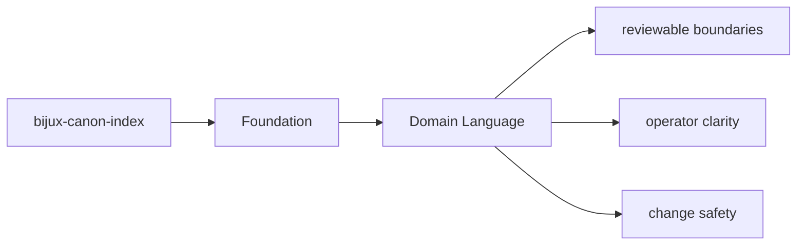
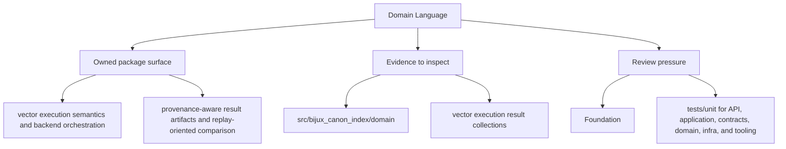

# Domain Language

The package should use language that reflects its actual ownership instead of borrowing
vague names from neighboring packages.

## Page Maps

## Package Vocabulary Anchors

- package name: `bijux-canon-index`
- Python import root: `bijux_canon_index`
- owning package directory: `packages/bijux-canon-index`
- key outputs: vector execution result collections, provenance and replay comparison reports, backend-specific metadata and audit output

## Use This Page When

- you need the package boundary before reading implementation detail
- you are deciding whether work belongs in this package or a neighboring one
- you need the shortest stable description of package intent

## What This Page Answers

- what bijux-canon-index is expected to own
- what remains outside the package boundary
- which neighboring seams a reviewer should compare next

## Reviewer Lens

- compare the stated package boundary with the owned modules and tests
- check that out-of-scope work is not quietly reintroduced through adjacent packages
- confirm that the package description still matches the real repository layout

## Purpose

This page records the naming anchors that should stay stable in docs, code, and review discussions.

## Stability

Keep it aligned with the package's real import names, directories, and artifact nouns.
