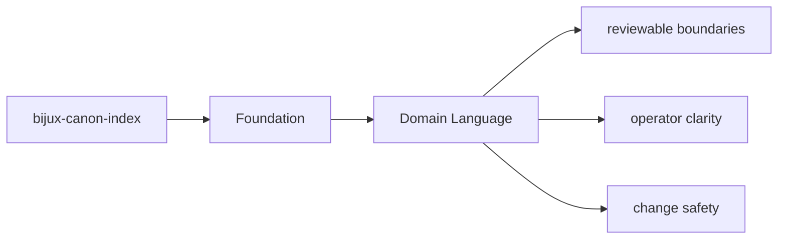
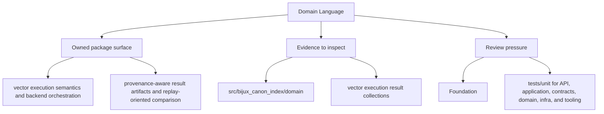

# Domain Language

The package should use language that reflects its actual ownership instead of borrowing
vague names from neighboring packages.

## Page Maps

## Package Vocabulary Anchors

- package name: `bijux-canon-index`
- Python import root: `bijux_canon_index`
- owning package directory: `packages/bijux-canon-index`
- key outputs: vector execution result collections, provenance and replay comparison reports, backend-specific metadata and audit output

## Concrete Anchors

- `packages/bijux-canon-index` as the package root
- `packages/bijux-canon-index/src/bijux_canon_index` as the import boundary
- `packages/bijux-canon-index/tests` as the package proof surface

## Use This Page When

- you need the package boundary before reading implementation detail
- you are deciding whether work belongs in this package or a neighboring one
- you need the shortest stable description of package intent

## What This Page Answers

- what bijux-canon-index is expected to own
- what remains outside the package boundary
- which neighboring seams a reviewer should compare next

## Reviewer Lens

- compare the stated package boundary with the owned modules and tests
- check that out-of-scope work is not quietly reintroduced through adjacent packages
- confirm that the package description still matches the real repository layout

## Honesty Boundary

This page can explain the intended boundary of bijux-canon-index, but it does not replace the code and tests that ultimately prove that boundary.

## Purpose

This page records the naming anchors that should stay stable in docs, code, and review discussions.

## Stability

Keep it aligned with the package's real import names, directories, and artifact nouns.

## Core Claim

The foundational claim of `bijux-canon-index` is that its package boundary can be explained in stable ownership terms instead of by implementation accident.

## Why It Matters

If the foundation pages for `bijux-canon-index` are weak, reviewers stop knowing where the package boundary really is and adjacent packages begin absorbing behavior by convenience instead of design.

## If It Drifts

- ownership starts migrating by convenience instead of by explicit package boundary
- neighboring packages inherit responsibilities without deliberate review
- reviewers lose confidence that the package description still means anything stable

## Representative Scenario

A contributor proposes moving new behavior into `bijux-canon-index` because it is nearby in the repository. This page should make it obvious whether that work fits the package boundary or belongs in a neighboring package instead.

## Source Of Truth Order

- `packages/bijux-canon-index/src/bijux_canon_index` for the real ownership boundary in code
- `packages/bijux-canon-index/tests` for executable proof of that boundary
- `packages/bijux-canon-index/README.md` and this section for the shortest maintained framing
