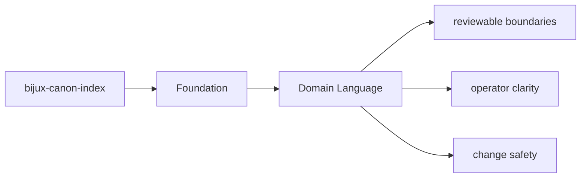

# Domain Language

The package should use language that reflects its actual ownership instead of borrowing
vague names from neighboring packages.

## Page Maps

## Package Vocabulary Anchors

- package name: `bijux-canon-index`
- Python import root: `bijux_canon_index`
- owning package directory: `packages/bijux-canon-index`
- key outputs: vector execution result collections, provenance and replay comparison reports, backend-specific metadata and audit output

## Purpose

This page records the naming anchors that should stay stable in docs, code, and review discussions.

## Stability

Keep it aligned with the package's real import names, directories, and artifact nouns.
