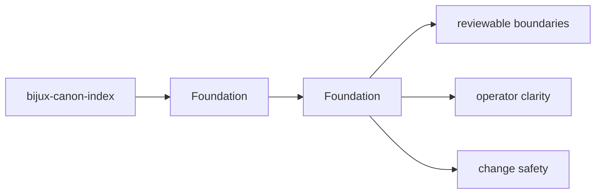
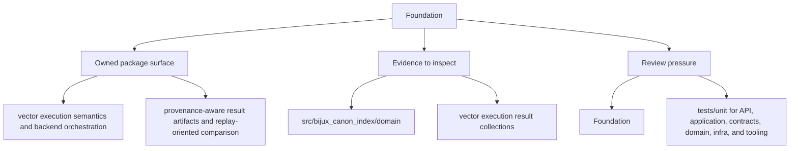

# Foundation

bijux-canon-index exists to own contract-driven vector execution with replay-aware determinism, audited backend behavior, and provenance-rich result handling.

## Page Maps

## Pages in This Section

- [Package Overview](package-overview.md)
- [Scope and Non-Goals](scope-and-non-goals.md)
- [Ownership Boundary](ownership-boundary.md)
- [Repository Fit](repository-fit.md)
- [Capability Map](capability-map.md)
- [Domain Language](domain-language.md)
- [Lifecycle Overview](lifecycle-overview.md)
- [Dependencies and Adjacencies](dependencies-and-adjacencies.md)
- [Change Principles](change-principles.md)

## Read Across the Package

- [Architecture](../architecture/index.md)
- [Interfaces](../interfaces/index.md)
- [Operations](../operations/index.md)
- [Quality](../quality/index.md)

## Use This Page When

- you need the package boundary before reading implementation detail
- you are deciding whether work belongs in this package or a neighboring one
- you need the shortest stable description of package intent

## What This Page Answers

- what bijux-canon-index is expected to own
- what remains outside the package boundary
- which neighboring seams a reviewer should compare next

## Purpose

This page explains how to use the foundation section for `bijux-canon-index` without repeating the detail that belongs on the topic pages beneath it.

## Stability

This page is part of the canonical package docs spine. Keep it aligned with the current package boundary and the topic pages in this section.
