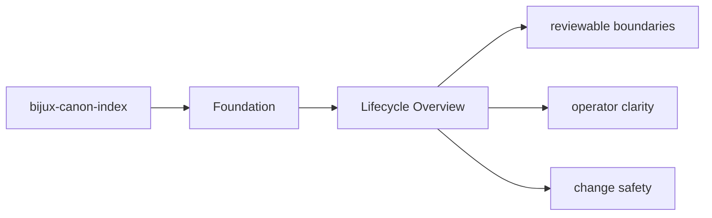

# Lifecycle Overview

Every package run follows a simple lifecycle: inputs enter through interfaces, domain and
application code coordinate the work, and durable artifacts or responses leave the package.

## Page Maps

## Lifecycle Anchors

- entry surfaces: CLI modules under src/bijux_canon_index/interfaces/cli, HTTP app under src/bijux_canon_index/api, OpenAPI schema files under apis/bijux-canon-index/v1
- code ownership: src/bijux_canon_index/domain, src/bijux_canon_index/application, src/bijux_canon_index/infra
- durable outputs: vector execution result collections, provenance and replay comparison reports, backend-specific metadata and audit output

## Purpose

This page keeps the package lifecycle readable before a reader dives into implementation detail.

## Stability

Keep it aligned with the current entrypoints and produced outputs.
