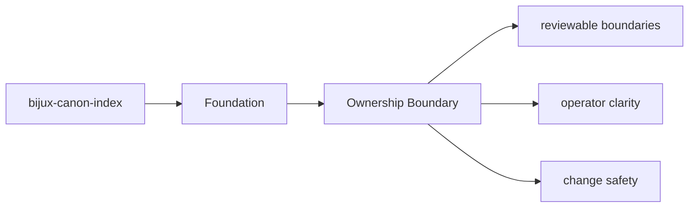

# Ownership Boundary

Ownership in `bijux-canon-index` is easiest to read from the source tree plus the tests that protect it.

## Page Maps

## Owned Code Areas

- `src/bijux_canon_index/domain` for execution, provenance, and request semantics
- `src/bijux_canon_index/application` for workflow coordination
- `src/bijux_canon_index/infra` for backends, adapters, and runtime environment helpers
- `src/bijux_canon_index/interfaces` for CLI and operator-facing edges
- `src/bijux_canon_index/api` for HTTP application surfaces
- `src/bijux_canon_index/contracts` for stable contract definitions

## Adjacent Systems

- consumes prepared inputs from ingest-oriented flows
- is governed by bijux-canon-runtime for final replay acceptance

## Purpose

This page ties package ownership to concrete directories instead of abstract slogans.

## Stability

Keep it aligned with the current module layout.
