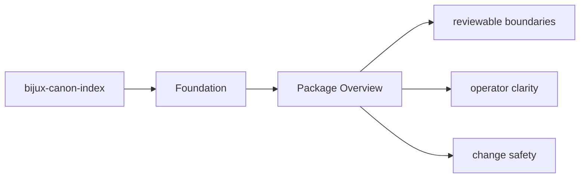
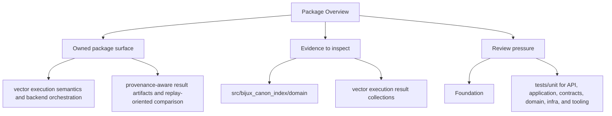

# Package Overview

`bijux-canon-index` is the package that owns contract-driven vector execution with replay-aware determinism, audited backend behavior, and provenance-rich result handling.

## Page Maps

## What It Owns

- vector execution semantics and backend orchestration
- provenance-aware result artifacts and replay-oriented comparison
- plugin-backed vector store, embedding, and runner integration
- package-local HTTP behavior and related schemas

## What It Does Not Own

- document ingestion and normalization
- runtime-wide replay policy and execution governance
- repository maintenance automation

## Purpose

This page gives the shortest honest description of what the package is for.

## Stability

Keep it aligned with the real package boundary described by the code and tests.
