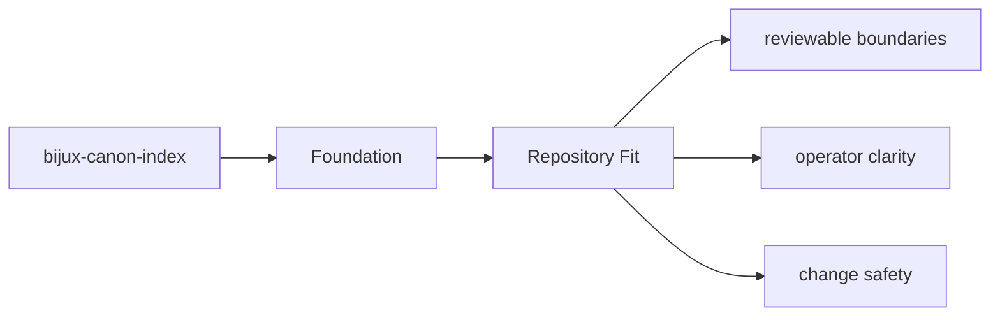

# Repository Fit

`bijux-canon-index` sits inside the monorepo as one publishable package with its own `src/`,
tests, metadata, and release history.

## Page Maps

## Repository Relationships

- consumes prepared inputs from ingest-oriented flows
- is governed by bijux-canon-runtime for final replay acceptance

## Canonical Package Root

- `packages/bijux-canon-index`
- `packages/bijux-canon-index/src/bijux_canon_index`
- `packages/bijux-canon-index/tests`

## Purpose

This page explains how the package fits into the repository without restating repository-wide rules.

## Stability

Keep it aligned with the package's checked-in directories and actual neighboring packages.
